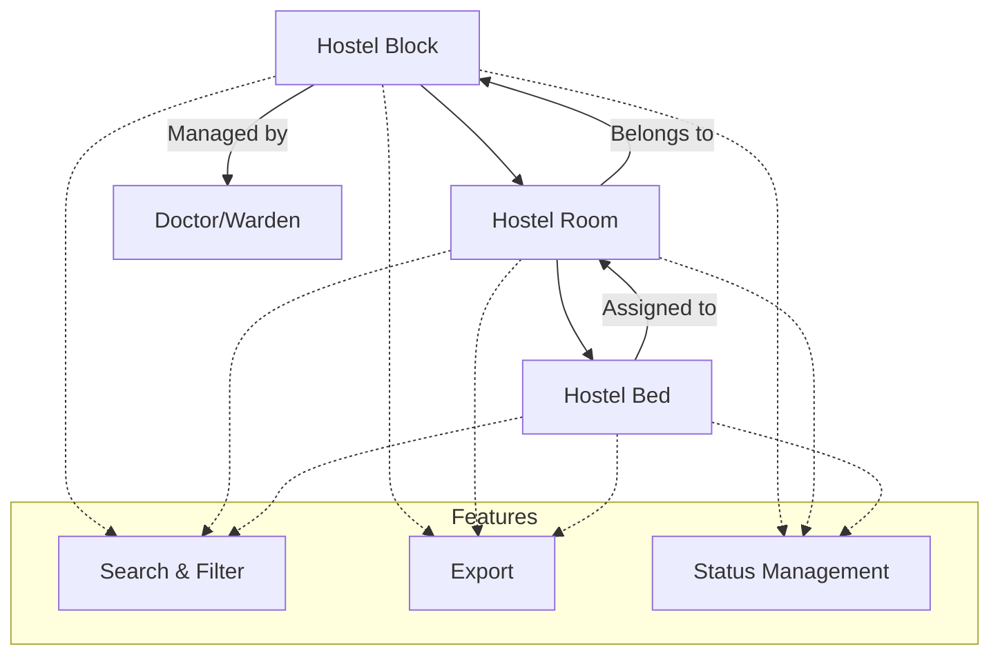

import { Callout } from 'nextra/components';

# Hostel Master

This section provides comprehensive management of hostel infrastructure, including blocks, rooms, and beds. It enables systematic creation and allocation, supports bed-level tracking, and ensures efficient and transparent handling of student accommodations.

The Hostel Master module is organized into three main sections:

### 1. Hostel Block

- **Features:** Create, edit, and view hostel blocks; track creator and creation date; manage active status.
- **Fields:** Block Name, Block Short Name, Hostel Type (Common/Female/Male), Address, Associated Doctor/Warden, Number of Floors, Active Status.

### 2. Hostel Room

- **Features:** Create/edit rooms by academic year and block; add accessories; view bed-level assignments.
- **Fields:** Room Number, Occupancy Type (Single/Double/Triple/Quadruple), Block, Floor, Standard Accessories, Created Date.

### 3. Hostel Bed

- **Features:** Assign/manage individual beds; check availability; handle complex occupancy types.
- **Fields:** Room Reference, Occupancy Type, Floor, Unique Bed Code, Created Date, Status.

---

## Architecture Diagram

The above diagram illustrates the core relationships and flow within the Hostel Master module:

- **Hostel Block** is the top-level entity, representing a physical building or section. Each block can be managed by a Doctor or Warden.
- **Hostel Room** entities are created within a block and represent individual rooms. Each room is linked to a specific block.
- **Hostel Bed** entities are associated with rooms, allowing for detailed tracking of bed-level occupancy and assignments.
- **Features** such as Search & Filter, Export, and Status Management are available across all entities, enabling efficient data handling and administrative control.

---

## Functional Flow

### Hostel Block Creation

1. Navigate to **Hostel Block > Create**.
2. Enter required details: Block Name, Short Name, Doctor/Warden, Hostel Type, Address, Total Floors.
3. Click **Create** to save the block.

### Room Creation

1. Navigate to **Hostel Room > Create**.
2. Enter Academic Year, Room Number & Type, Block & Floor, Accessories.
3. Submit to create the room.

### Bed Assignment

1. Navigate to **Hostel Bed**.
2. Beds are auto-generated or manually created and linked to rooms.
3. Manage bed status (Active/Inactive) as required.

---

## Field Specifications

### Hostel Block

| Field            | Type    | Required | Description                      |
| ---------------- | ------- | -------- | -------------------------------- |
| Block Name       | Text    | Yes      | Name of the hostel block         |
| Block Short Name | Text    | Yes      | Abbreviated identifier           |
| Hostel Type      | Select  | Yes      | Common / Female / Male           |
| Address          | Text    | Yes      | Location/address of the block    |
| Doctor Name      | Text    | No       | Associated doctor (if any)       |
| Warden Name      | Text    | No       | Associated warden                |
| Number of Floors | Number  | Yes      | Total floors in the block        |
| Active Status    | Boolean | Yes      | Indicates if the block is active |

### Hostel Room

| Field          | Type   | Required | Description                               |
| -------------- | ------ | -------- | ----------------------------------------- |
| Room Number    | Text   | Yes      | Unique room number                        |
| Occupancy Type | Select | Yes      | Single / Double / Triple / Quadruple      |
| Block          | Select | Yes      | Associated block                          |
| Floor          | Select | Yes      | Associated floor                          |
| Accessories    | Text   | No       | Standard accessories (e.g., Table, Chair) |
| Created Date   | Date   | Yes      | Date of creation                          |

### Hostel Bed

| Field          | Type    | Required | Description           |
| -------------- | ------- | -------- | --------------------- |
| Room Reference | Select  | Yes      | Linked room           |
| Occupancy Type | Select  | Yes      | Bed occupancy type    |
| Floor          | Select  | Yes      | Associated floor      |
| Bed Code       | Text    | Yes      | Unique bed identifier |
| Created Date   | Date    | Yes      | Date of creation      |
| Status         | Boolean | Yes      | Active/Inactive       |
