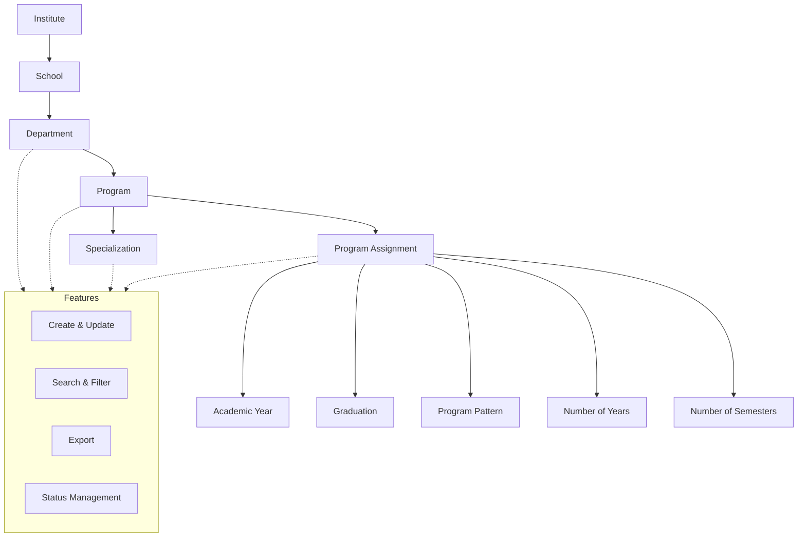

import { Callout } from 'nextra/components';

# Academic Master

The **Academic Master** module is a core component of the ERP system, providing centralized and standardized management of academic structures and offerings. It enables efficient administration of departments, programs, program assignments, and specializations, ensuring data consistency and seamless integration across the platform.

---

## Key Functionalities

### Department Management

- Define and manage departments (e.g., Computer Applications).
- Add, edit, and update department details, including short names, web status, service tag.
- View all departments in a searchable, filterable table.

### Department Assignment

- Assign academic departments to one or more schools.
- Set priority for department assignments.
- Manage which schools offer which departments.

### Program Management

- Define and manage academic programs (e.g., BBA in Sports Management, Bachelor of Engineering).
- Add, edit, and update program details, including short names, display names, and codes.
- View all programs in a searchable, filterable table.

### Program Assignment

- Assign programs to schools for specific academic years and graduation categories.
- Set program patterns (e.g., yearly, semester), number of years, and semesters.
- Manage which programs are available in which schools and years.

### Specialization Management

- Define and manage specializations within programs (e.g., Sports Management, Cloud & Full Stack, Cyber Security).
- Assign specializations to specific programs, schools, and departments.
- Maintain unique identifiers and display names for each specialization.

  <Callout type="info">
    All sections support create, update, search, filter, and export operations.
  </Callout>

<Callout type="info">
  <b>Status Management:</b> Toggle active/inactive status for each record.
</Callout>

<Callout type="warning">
  <b>Note:</b> Delete is not supported.
</Callout>

Data is presented in tabular format, with columns for key attributes, update actions, and active status indicators.

---

## Architecture

The Academic Master follows a sophisticated hierarchical model that mirrors real-world educational institutions:

**Primary Structure:**

- **Institute** → **School** → **Department** → **Program** → **Specialization**
- **Program Assignments** linking programs to schools with academic year
- **Pattern Configurations** defining semester/yearly structures
- **Duration** with automatic calculation capabilities

Common features such as create, update, search, filter, export, and status management are available across all entities.

---

## Field Specifications

### Department Assignment

| Field      | Type         | Required | Description                                                       |
| ---------- | ------------ | -------- | ----------------------------------------------------------------- |
| Department | Select       | Yes      | Department to assign (e.g., Civil Engineering)                    |
| Priority   | Number       | No       | Priority order for assignment (higher number = lower priority)    |
| School     | Multi-Select | Yes      | Schools to which the department is assigned (e.g., ASD, APS, NRC) |

### Program

| Field        | Type | Required | Description                                            |
| ------------ | ---- | -------- | ------------------------------------------------------ |
| Program      | Text | Yes      | Name of the program (e.g., BBA in Sports Management)   |
| Short Name   | Text | Yes      | Abbreviated identifier for the program (e.g., "SPRTS") |
| Display Name | Text | No       | Display name for the program (e.g., "BBA SPORTS MGMT") |
| Program Code | Text | No       | Unique code for the program (e.g., "SP")               |

### Program Assignment

| Field              | Type   | Required | Description                                     |
| ------------------ | ------ | -------- | ----------------------------------------------- |
| Academic Year      | Select | Yes      | Academic year for assignment (e.g., 2025-2026)  |
| School             | Select | Yes      | School to which the program is assigned         |
| Program            | Select | Yes      | Program to assign                               |
| Graduation         | Select | Yes      | Graduation category (e.g., UG, PG, PUC)         |
| Program Pattern    | Select | Yes      | Pattern of the program (e.g., YEARLY, SEMESTER) |
| Number Of Year     | Number | Yes      | Number of years for the program (e.g., 4)       |
| Number Of Semester | Number | No       | Number of semesters (e.g., 8, if applicable)    |

### Specialization

| Field                  | Type   | Required | Description                                          |
| ---------------------- | ------ | -------- | ---------------------------------------------------- |
| Program Specialization | Text   | Yes      | Name of the specialization (e.g., Sports Management) |
| Short Name             | Text   | Yes      | Abbreviated identifier for the specialization        |
| AUID Format            | Text   | No       | Unique identifier format (if applicable)             |
| School                 | Select | Yes      | School offering the specialization                   |
| Program                | Select | Yes      | Program associated with the specialization           |
| Department             | Select | Yes      | Department associated with the specialization        |

---
