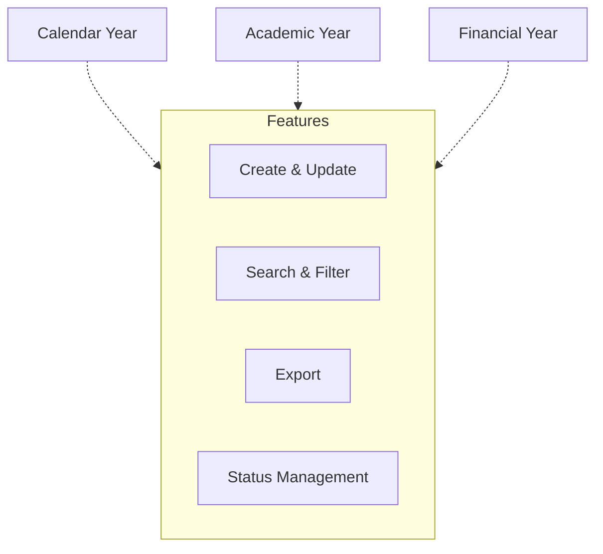

import { Callout } from 'nextra/components';

# Year Creation

The **Year Creation** module is a foundational part of the ERP system, providing centralized and standardized management of institutional calendar years, academic years, and financial years. This ensures consistency and accuracy across all time-based operations within the institution.

---

## Key Functionalities

- **Calendar Year Management:** Manage calendar years, including year identifiers, start and end dates, and remarks.
- **Academic Year Management:** Define academic years with relevant dates and notes for academic planning and reporting.
- **Financial Year Management:** Maintain financial years for budgeting, accounting, and compliance purposes.

<Callout type="info">
  All sections support create, update, search, filter, and export operations.
</Callout>

<Callout type="info">
  <b>Status Management:</b> Toggle active/inactive status for each record.
</Callout>

<Callout type="warning">
  <b>Note:</b> Delete is not supported.
</Callout>

Data is presented in tabular format, with columns for key attributes, update actions, and active status indicators.

---

## Architecture

The following diagram illustrates the structure of the Year Creation module. Each year type (Calendar Year, Academic Year, Financial Year) is managed independently but shares common features such as create, update, search, filter, export, and status management.

---

## Field Specifications

### Calendar Year

| Field         | Type | Required | Description                                  |
| ------------- | ---- | -------- | -------------------------------------------- |
| Calendar Year | Text | Yes      | Year identifier (e.g., "2025")               |
| From Date     | Date | Yes      | Start date of the calendar year (dd/mm/yyyy) |
| To Date       | Date | Yes      | End date of the calendar year (dd/mm/yyyy)   |
| Remarks       | Text | No       | Additional notes or comments                 |

### Academic Year

| Field         | Type | Required | Description                                  |
| ------------- | ---- | -------- | -------------------------------------------- |
| Academic Year | Text | Yes      | Year identifier (e.g., "2025")               |
| From Date     | Date | Yes      | Start date of the academic year (dd/mm/yyyy) |
| To Date       | Date | Yes      | End date of the academic year (dd/mm/yyyy)   |
| Remarks       | Text | No       | Additional notes or comments                 |

### Financial Year

| Field          | Type | Required | Description                                   |
| -------------- | ---- | -------- | --------------------------------------------- |
| Financial Year | Text | Yes      | Year identifier (e.g., "2025")                |
| From Date      | Date | Yes      | Start date of the financial year (dd/mm/yyyy) |
| To Date        | Date | Yes      | End date of the financial year (dd/mm/yyyy)   |
| Remarks        | Text | No       | Additional notes or comments                  |

---
