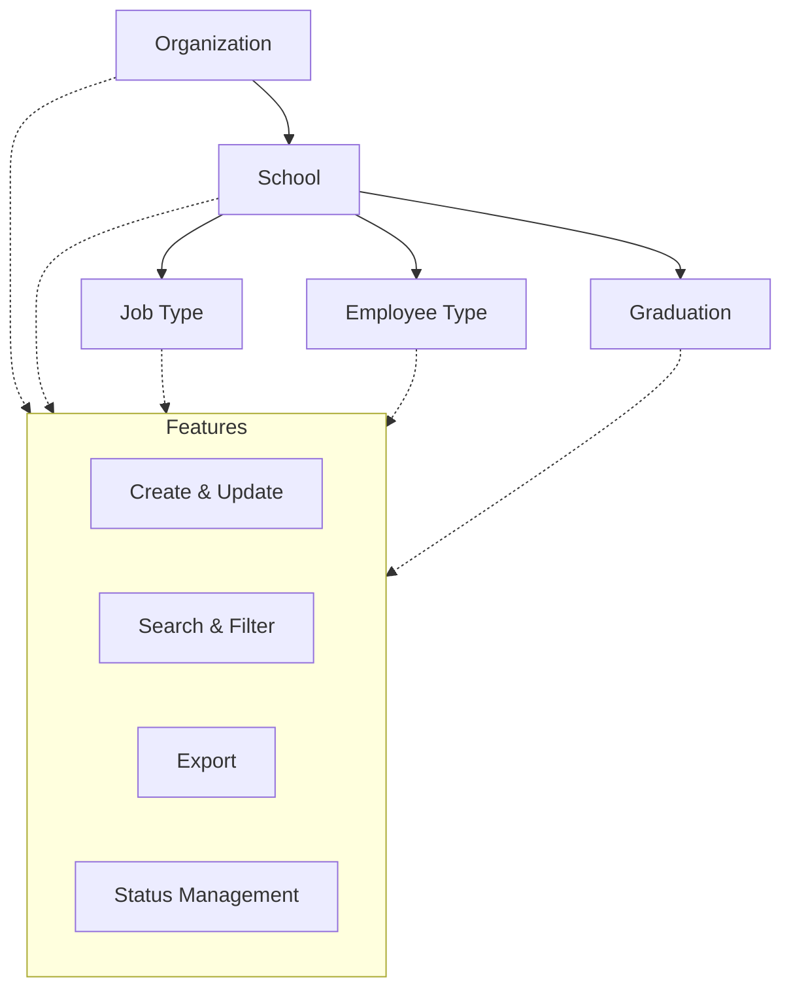

# Base Master

The Institute Base Master module is a foundational component of the ERP system, designed to centralize and standardize the management of core institutional data. This module enables efficient administration of organizations, schools, job types, employee types, and graduation categories, ensuring data consistency and seamless integration across the platform.

---

## Architecture

The following diagram illustrates the relationships between the main entities managed by the Base Master module. Organizations contain schools, which are associated with job types, employee types, and graduation categories. Each entity supports common features such as create, update, search, filter, export, and status management.

---

## Key Functionalities

- **Organization Management:** Create, update, and maintain organization records, including essential details such as name, short name, address, and status.
- **School Management:** Manage school entities with attributes like name, short name, email, associated organization, job types, priority, color, web status, academic status, and reference information.
- **Job Type Management:** Define and maintain job types (e.g., Teaching, Non-Teaching, Admin, Lab) with corresponding short names.
- **Employee Type Management:** Configure various employment types (e.g., Consultant, Fixed Term, On Role Recruitment) and their short names.
- **Graduation Category Management:** Organize graduation categories (e.g., UG, PG, Diploma, Research) and their identifiers.

All sections support create, edit, search, filter, and export operations. Data is presented in tabular format, with columns for key attributes, update actions, and active status indicators.

---

## Entity Details & Form Fields

### Organization

| Field        | Type | Required | Description                                               |
| ------------ | ---- | -------- | --------------------------------------------------------- |
| Organization | Text | Yes      | Full name of the organization (e.g., "Acharya Institute") |
| Short Name   | Text | Yes      | Abbreviated identifier (e.g., "AIS")                      |
| Address      | Text | Yes      | Official address of the organization                      |

### School

| Field           | Type   | Required | Description                            |
| --------------- | ------ | -------- | -------------------------------------- |
| School Name     | Text   | Yes      | Full name of the school                |
| Short Name      | Text   | Yes      | Abbreviated identifier for the school  |
| Email           | Text   | Yes      | Official email address of the school   |
| Organization    | Text   | Yes      | Linked organization                    |
| Job Type        | Text   | Yes      | Associated job types (comma separated) |
| Priority        | Number | Yes      | Priority order                         |
| Color           | Text   | Yes      | Color code for school                  |
| Web Status      | Text   | Yes      | Web status (Yes/No)                    |
| Academic Status | Text   | Yes      | Academic status (Yes/No)               |
| Reference       | Text   | No       | Reference information                  |

### Job Type

| Field      | Type | Required | Description                           |
| ---------- | ---- | -------- | ------------------------------------- |
| Job Type   | Text | Yes      | Name of the job type (e.g., Teaching) |
| Short Name | Text | Yes      | Abbreviated identifier (e.g., "TCH")  |

### Employee Type

| Field         | Type | Required | Description                           |
| ------------- | ---- | -------- | ------------------------------------- |
| Employee Type | Text | Yes      | Type of employment (e.g., Consultant) |
| Short Name    | Text | Yes      | Abbreviated identifier (e.g., "CON")  |

### Graduation

| Field           | Type | Required | Description                                    |
| --------------- | ---- | -------- | ---------------------------------------------- |
| Graduation Name | Text | Yes      | Name of the graduation category (e.g., UG, PG) |
| Short Name      | Text | Yes      | Abbreviated identifier (e.g., "UG")            |

---

## Common Features

- **CRUD Operations:** All entities support create, read, update, and delete actions.
- **Search & Filter:** Quickly locate records using search and filter tools.
- **Export:** Export data for reporting or integration purposes.
- **Status Management:** Toggle active/inactive status for each record.

---
