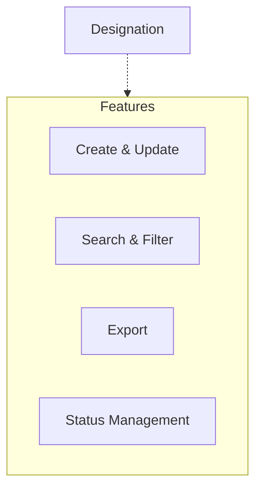

import { Callout } from 'nextra/components';

# Designation Master

The **Designation Master** module provides a centralized platform for managing all designations within the institution. By standardizing designation records, this module ensures consistency across employee and organizational data, supporting efficient HR and administrative processes.

---

## Architecture

The following diagram illustrates the structure of the Designation Master module. Each designation is managed independently and supports common features such as create, update, search, filter, export, and status management. Designations are referenced throughout the ERP system, especially in employee and organizational modules.

---

## Key Functionalities

- **Designation Management:** Create, update, and maintain designation records, including designation name, short name, and priority.
- **Search & Filter:** Quickly locate designations using search and filter tools.
- **Status Management:** Toggle active/inactive status for each designation.
- **Export:** Export designation data for reporting or integration purposes.

<Callout type="info">
  All sections support create, update, search, filter, and export operations.
</Callout>

<Callout type="warning">
  <b>Note:</b> Delete is not supported.
</Callout>

Data is presented in tabular format, with columns for key attributes, update actions, and active status indicators.

---

## Field Specifications

### Designation

| Field       | Type   | Required | Description                               |
| ----------- | ------ | -------- | ----------------------------------------- |
| Designation | Text   | Yes      | Name of the designation (e.g., "Trainer") |
| Short Name  | Text   | Yes      | Abbreviated identifier (e.g., "TPO")      |
| Priority    | Number | Yes      | Priority order for the designation        |

---

## Common Features

- **Create, Update, Select:** All entities support create, update, and select (read) actions. Delete is not supported.
- **Search & Filter:** Quickly locate records using search and filter tools.
- **Export:** Export data for reporting or integration purposes.
- **Status Management:** Toggle active/inactive status for each record.

---
