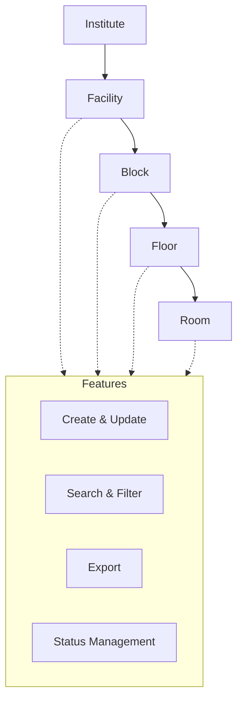

import { Callout } from 'nextra/components';

# Infrastructure Master

The **Infrastructure Master** module provides centralized management of all physical infrastructure assets within the institution, including facilities, blocks, floors, and rooms. This module ensures accurate tracking, efficient allocation, and streamlined reporting of infrastructure resources.

---

## Key Functionalities

- **Facility Management:** Define and manage various facility types (e.g., labs, classrooms, sports areas), including codes, descriptions, and TT status.
- **Block Management:** Create and maintain blocks with details such as block name, code, associated school, total floors, build-up area, survey number, document number, type of facility, and basement status.
- **Floor Management:** Manage floors within blocks, including floor names, codes, and associations with blocks and institutes.
- **Room Management:** Add and update rooms with attributes such as institute, block, floor, number of rooms, area, facility type, strength, manual room number, and remarks.
- **Search & Filter:** Quickly locate facilities, blocks, floors, or rooms using advanced search and filter tools.
- **Status Management:** Toggle active/inactive status for each infrastructure entity.
- **Export:** Export infrastructure data for reporting or integration purposes.

<Callout type="info">
  All sections support create, update, search, filter, and export operations.
</Callout>

<Callout type="warning">
  <b>Note:</b> Delete is not supported.
</Callout>

Data is presented in tabular format, with columns for key attributes, update actions, and active status indicators.

---

## Architecture

The Infrastructure Master module follows a hierarchical structure:  
**Institute → Facility → Block → Floor → Room**  
Each entity is linked to its parent, enabling granular management and reporting.

---

## Field Specifications

### Facility

| Field            | Type    | Required | Description                              |
| ---------------- | ------- | -------- | ---------------------------------------- |
| Type of Facility | Text    | Yes      | Name of the facility type (e.g., Lab)    |
| Short Name       | Text    | Yes      | Abbreviated identifier                   |
| Code             | Text    | Yes      | Unique code for the facility             |
| Description      | Text    | Yes      | Description of the facility              |
| Remarks          | Text    | Yes      | Additional notes                         |
| TT Status        | Boolean | Yes      | Indicates if used for timetable (Yes/No) |

### Block

| Field               | Type    | Required | Description                                    |
| ------------------- | ------- | -------- | ---------------------------------------------- |
| Block Name          | Text    | Yes      | Name of the block                              |
| Short Name          | Text    | Yes      | Abbreviated identifier                         |
| School Name         | Select  | Yes      | School associated with the block               |
| Total no of Floors  | Number  | Yes      | Total number of floors in the block            |
| Block Code          | Text    | Yes      | Unique code for the block                      |
| Total Build Up Area | Number  | Yes      | Total built-up area (sq ft)                    |
| Survey Number       | Text    | Yes      | Survey number for the block                    |
| Document Number     | Text    | Yes      | Document number for the block                  |
| Type of Facility    | Select  | Yes      | Facility type associated with the block        |
| Remarks             | Text    | Yes      | Additional notes                               |
| Basement            | Boolean | Yes      | Indicates if the block has a basement (Yes/No) |

### Floor

| Field          | Type    | Required | Description                           |
| -------------- | ------- | -------- | ------------------------------------- |
| Institute Name | Select  | Yes      | Institute to which the floor belongs  |
| Block Name     | Select  | Yes      | Block to which the floor belongs      |
| Block Code     | Text    | Yes      | Code of the block                     |
| Floor Name     | Text    | Yes      | Name of the floor                     |
| Floor Code     | Text    | Yes      | Unique code for the floor             |
| Created By     | Text    | Yes      | User who created the record           |
| Created Date   | Date    | Yes      | Date of creation                      |
| Active         | Boolean | Yes      | Status of the floor (Active/Inactive) |

### Room

| Field          | Type    | Required | Description                          |
| -------------- | ------- | -------- | ------------------------------------ |
| Institute Name | Select  | Yes      | Institute to which the room belongs  |
| Block Name     | Select  | Yes      | Block to which the room belongs      |
| Floor Name     | Select  | Yes      | Floor to which the room belongs      |
| No Of Rooms    | Number  | Yes      | Number of rooms being added          |
| Room No        | Text    | Yes      | Room number                          |
| Room Code      | Text    | Yes      | Unique code for the room             |
| Area           | Number  | No       | Area of the room (sq ft)             |
| Facility Type  | Select  | No       | Facility type for the room           |
| Strength       | Number  | No       | Capacity/strength of the room        |
| Manual Room No | Text    | No       | Manual room number (if any)          |
| Remarks        | Text    | Yes      | Additional notes                     |
| Created By     | Text    | Yes      | User who created the record          |
| Created Date   | Date    | Yes      | Date of creation                     |
| Active         | Boolean | Yes      | Status of the room (Active/Inactive) |

---

## Common Features

- **Create, Update, Select:** All entities support create, update, and select (read) actions. Delete is not supported.
- **Search & Filter:** Quickly locate records using search and filter tools.
- **Export:** Export data for reporting or integration purposes.
- **Status Management:** Toggle active/inactive status for each record.

---
