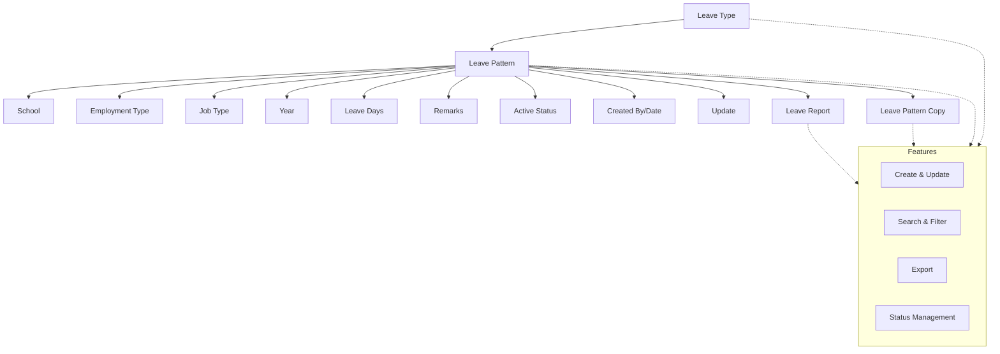

import { Callout } from 'nextra/components';

# Leave Master

The **Leave Master** module provides comprehensive management of leave types, leave patterns, and leave reporting for employees across the institution. It enables administrators to define leave policies, assign leave entitlements, and generate detailed reports, ensuring transparency and compliance with institutional HR policies.

---

## Key Functionalities

- **Leave Type Management:** Define and manage various leave types (e.g., Casual Leave, Earned Leave, Medical Leave, etc.), including short names, type (Leave/Holiday/Attendance), attachment requirements, HR status, leave kitty, and remarks.
- **Leave Pattern Management:** Configure leave entitlements for different combinations of year, school, employment type, job type, and leave type. Assign leave days and add remarks.
- **Leave Pattern Copy:** Copy leave patterns from one year to another to streamline yearly configuration.
- **Leave Reporting:** Generate and view detailed leave reports by year, institute, employment type, job type, and leave type.

<Callout type="info">
  All sections support create, update, search, filter, and export operations.
</Callout>

<Callout type="info">
  <b>Status Management:</b> Toggle active/inactive status for each record.
</Callout>

<Callout type="warning">
  <b>Note:</b> Delete is not supported.
</Callout>

Data is presented in tabular format, with columns for key attributes, update actions, and active status indicators.

---

## Architecture

The Leave Master module is structured to support flexible leave policy management. Leave types are defined centrally and linked to leave patterns, which are assigned to schools and employee groups. Reporting and pattern copy features provide efficient leave administration.

---

## Field Specifications

### Leave Type

| Field               | Type    | Required | Description                                   |
| ------------------- | ------- | -------- | --------------------------------------------- |
| Leave Name          | Text    | Yes      | Name of the leave type (e.g., "Casual Leave") |
| Short Name          | Text    | Yes      | Abbreviated identifier (e.g., "CL")           |
| Type                | Select  | Yes      | Leave, Holiday, or Attendance                 |
| Leave Kitty         | Boolean | Yes      | Indicates if leave kitty is enabled           |
| Attachment Required | Boolean | Yes      | Whether an attachment is required             |
| HR Status           | Boolean | Yes      | If Yes, not visible to end user               |
| Remarks             | Text    | No       | Additional notes or comments                  |

### Leave Pattern

| Field             | Type   | Required | Description                                             |
| ----------------- | ------ | -------- | ------------------------------------------------------- |
| Year              | Select | Yes      | Year for which the leave pattern applies                |
| Leave Type        | Select | Yes      | Leave type being assigned                               |
| School Names      | Select | Yes      | Schools to which the pattern applies                    |
| Employment Type   | Select | Yes      | Employment type (e.g., On Role, Fixed Term, Consultant) |
| Job Type          | Select | Yes      | Job type (e.g., Teaching, Admin, Lab, Non Teaching)     |
| Leave Days Permit | Number | Yes      | Number of leave days permitted                          |
| Remarks           | Text   | No       | Additional notes or comments                            |

### Leave Pattern Copy

| Field     | Type   | Required | Description                               |
| --------- | ------ | -------- | ----------------------------------------- |
| From Year | Select | Yes      | Source year to copy leave pattern from    |
| To Year   | Select | Yes      | Destination year to copy leave pattern to |
| Institute | Select | Yes      | Institute for which the pattern is copied |

### Leave Report

| Field     | Type   | Required | Description                                 |
| --------- | ------ | -------- | ------------------------------------------- |
| Year      | Select | Yes      | Year for which the report is generated      |
| Institute | Select | Yes      | Institute for which the report is generated |

---

## Common Features

- **Create, Update, Select:** All entities support create, update, and select (read) actions. Delete is not supported.
- **Search & Filter:** Quickly locate records using search and filter tools.
- **Export:** Export data for reporting or integration purposes.
- **Status Management:** Toggle active/inactive status for each record.

---
