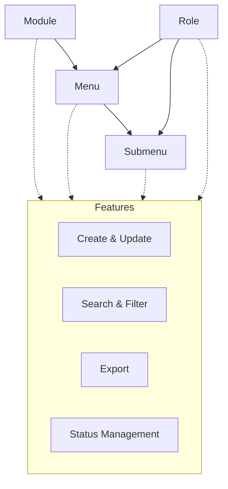

# Navigation Master (Menu Mapper)

The **Navigation Master** module provides a centralized platform for managing all navigation entities within the ERP system, including modules, menus, submenus, and roles. This ensures a consistent and secure navigation experience for all users and supports efficient access control and menu configuration.

---

## Architecture

The following diagram illustrates the hierarchical structure of the Navigation Master module. Modules contain menus, menus contain submenus, and roles are mapped to menus and submenus for access control. Each entity supports common features such as create, update, search, filter, export, and status management.

---

## Key Functionalities

- **Module Management:** Create, update, and maintain modules, including name, short name, creator, and creation date.
- **Menu Management:** Define and manage menus with details such as name, short name, description, associated module, creator, and status.
- **Submenu Management:** Add and update submenus, including URLs, associated menus and modules, and status.
- **Role Management:** Manage roles, including LMS status, HR access, leave initiation, and menu/submenu access mapping.
- **Search & Filter:** Quickly locate modules, menus, submenus, or roles using advanced search and filter tools.
- **Status Management:** Toggle active/inactive status for each navigation entity.
- **Export:** Export navigation data for reporting or integration purposes.

All sections support create, update, search, filter, and export operations. Data is displayed in tabular format, with columns for key attributes, update actions, and active status indicators.

---

## Field Specifications

### Module

| Field       | Type | Required | Description                                 |
| ----------- | ---- | -------- | ------------------------------------------- |
| Module Name | Text | Yes      | Full name of the module (e.g., "Academics") |
| Short Name  | Text | Yes      | Abbreviated identifier (e.g., "ACM")        |

### Menu

| Field       | Type | Required | Description                                     |
| ----------- | ---- | -------- | ----------------------------------------------- |
| Menu Name   | Text | Yes      | Full name of the menu (e.g., "Academic Master") |
| Module Name | Text | Yes      | Associated module                               |
| Short Name  | Text | Yes      | Abbreviated identifier (e.g., "ACAM")           |
| Description | Text | Yes      | Brief description of the menu                   |

### Submenu

| Field        | Type | Required | Description                                   |
| ------------ | ---- | -------- | --------------------------------------------- |
| Submenu Name | Text | Yes      | Name of the submenu (e.g., "Payment Voucher") |
| URL          | Text | Yes      | URL path for the submenu                      |
| Menu Name    | Text | Yes      | Associated menu                               |
| Module Name  | Text | Yes      | Associated module                             |
| Status       | Text | Yes      | Indicates if the submenu is active            |

### Role

| Field       | Type | Required | Description                          |
| ----------- | ---- | -------- | ------------------------------------ |
| Role Name   | Text | Yes      | Name of the role (e.g., "Director")  |
| Short Name  | Text | Yes      | Abbreviated identifier (e.g., "DIR") |
| Description | Text | Yes      | Brief description of the role        |

---

## Common Features

- **Create, Update, Select:** All entities support create, update, and select (read) actions. Delete is not supported.
- **Search & Filter:** Quickly locate records using search and filter tools.
- **Export:** Export data for reporting or integration purposes.
- **Status Management:** Toggle active/inactive status for each record.

---
