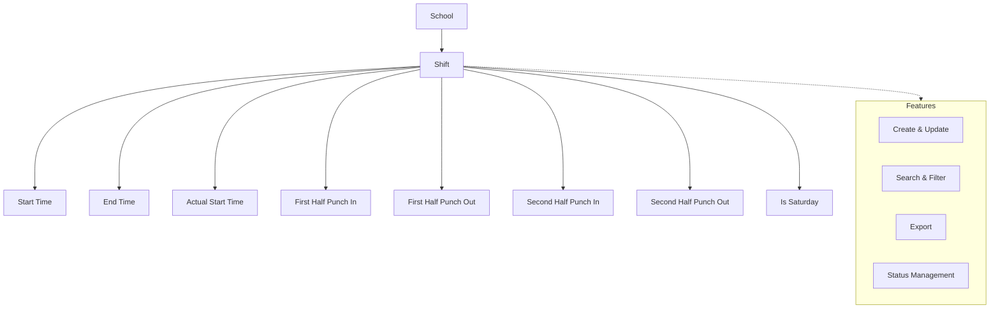

import { Callout } from 'nextra/components';

# Shift Master

The **Shift Master** module provides centralized management of shift schedules for schools within the institution. It enables administrators to define, update, and organize shift timings, ensuring accurate attendance tracking and operational efficiency.

---

## Key Functionalities

- **Shift Management:** Create, update, and maintain shift records for each school, including shift names and detailed timing configurations.
- **Time Configuration:** Specify start and end times, actual start time, punch in/out times for both halves, and indicate if the shift applies to Saturdays.
- **Search & Filter:** Quickly locate shifts using search and filter tools.
- **Status Management:** Toggle active/inactive status for each shift.
- **Export:** Export shift data for reporting or integration purposes.

<Callout type="info">
  All sections support create, update, search, filter, and export operations.
</Callout>

<Callout type="warning">
  <b>Note:</b> Delete is not supported.
</Callout>

Data is presented in tabular format, with columns for key attributes, update actions, and active status indicators.

---

## Architecture

The Shift Master module links each shift to a specific school and manages detailed timing for attendance and operational needs. Common features such as create, update, search, filter, export, and status management are available for all shift records.

---

## Field Specifications

### Shift

| Field                      | Type    | Required | Description                                     |
| -------------------------- | ------- | -------- | ----------------------------------------------- |
| School                     | Select  | Yes      | School to which the shift is assigned           |
| Shift Name                 | Text    | Yes      | Name of the shift                               |
| Start Time                 | Time    | Yes      | Scheduled start time (hh:mm)                    |
| End Time                   | Time    | Yes      | Scheduled end time (hh:mm)                      |
| Actual Start Time          | Time    | Yes      | Actual start time for attendance (hh:mm)        |
| First Half Punch In Time   | Time    | Yes      | Punch in time for the first half (hh:mm)        |
| First Half Punch Out Time  | Time    | Yes      | Punch out time for the first half (hh:mm)       |
| Second Half Punch In Time  | Time    | Yes      | Punch in time for the second half (hh:mm)       |
| Second Half Punch Out Time | Time    | Yes      | Punch out time for the second half (hh:mm)      |
| Is Saturday                | Boolean | Yes      | Indicates if the shift is for Saturday (Yes/No) |

---

## Common Features

- **Create, Update, Select:** All entities support create, update, and select (read) actions. Delete is not supported.
- **Search & Filter:** Quickly locate records using search and filter tools.
- **Export:** Export data for reporting or integration purposes.
- **Status Management:** Toggle active/inactive status for each record.

---
