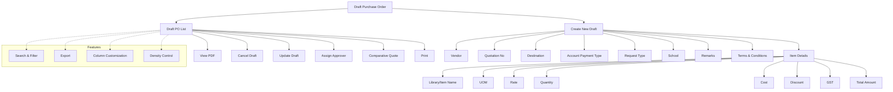

# Draft Purchase Order

The **Draft Purchase Order** section in Acharya ERP allows users to create, view, and manage draft purchase orders before final approval and processing. This module provides a comprehensive list of all draft purchase orders, with options to view details, print or download as PDF, cancel drafts, update information, and assign approvers. Users can also initiate new purchase order drafts by entering all required details.

---

## Key Features

- **View Draft Purchase Orders:** See a list of all draft purchase orders with details such as created date, created by, vendor, total amount, and status.
- **View/Print PDF:** Open and print/download the draft purchase order as a PDF document.
- **Cancel Draft:** Cancel a draft purchase order if it is no longer required.
- **Update Draft:** Edit and update draft purchase order details before finalization.
- **Assign Approver:** Assign an approver to each draft purchase order from a list of eligible users.
- **Create New Draft:** Initiate a new draft purchase order by entering vendor, quotation number, destination, account payment type, request type, item details, and other relevant fields.
- **Search, Filter, and Export:** Use advanced tools to search, filter, and export draft purchase order data.
- **Column Customization & Density:** Adjust visible columns and table density for better readability.

---

## Architecture Diagram

- The main view displays a list of all draft purchase orders with options to view PDF, cancel, update, assign approver, and print.
- Users can create a new draft by entering vendor, quotation number, destination, account payment type, request type, school, remarks, terms, and item details (including library/item, UOM, rate, quantity, cost, discount, GST, and total amount).
- Features such as search, filter, export, column customization, and density control are available for efficient management.

---

## Functional Flow

1. **View Draft Purchase Orders:**  
   Access the list of all draft purchase orders with their details and available actions.

2. **Create New Draft:**  
   Click "Create" and fill in all required fields to initiate a new draft purchase order.

3. **Update or Cancel Draft:**  
   Edit draft details as needed or cancel drafts that are no longer required.

4. **Assign Approver:**  
   Select an approver from the eligible user list for each draft purchase order.

5. **View/Print PDF:**  
   Open and print or download the draft purchase order as a PDF.

6. **Search, Filter, and Export:**  
   Use search and filter tools to quickly find specific drafts. Export the list as needed.

---

## Field Specifications

| Field                | Description                                     |
| -------------------- | ----------------------------------------------- |
| Created Date         | Date the draft purchase order was created       |
| Created By           | User who created the draft                      |
| Vendor               | Vendor name                                     |
| Quotation No         | Quotation number                                |
| Destination          | Delivery destination                            |
| Account Payment Type | Payment type (Advance, After GRN/SRN, etc.)     |
| Request Type         | Type of request (GRN, SRN, Library Books, etc.) |
| School               | School/department placing the order             |
| Remarks              | Additional remarks                              |
| Terms & Conditions   | Purchase order terms and conditions             |
| Item Details         | List of items (name, UOM, rate, quantity, etc.) |
| Total Amount         | Total amount for the purchase order             |
| Draft PO             | View draft purchase order details               |
| Print                | Print/download draft as PDF                     |
| Cancel               | Cancel the draft purchase order                 |
| Update               | Edit draft purchase order                       |
| Comparative Quote    | View comparative quote (if available)           |
| Assign Approver      | Assign an approver to the draft                 |
