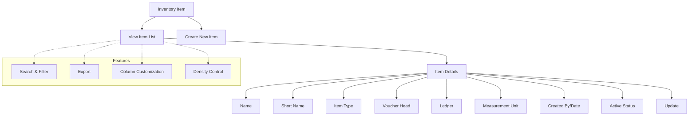

# Inventory Item

The **Inventory Item** section in Acharya ERP allows administrators to view, create, and manage all inventory items used within the institution. This module provides a centralized list of items, including their details, types, voucher heads, ledgers, and status. It supports efficient inventory tracking, item creation, and updates.

---

## Key Features

- **View Inventory Items:** See a comprehensive list of all inventory items, including name, short name, item type (goods/service), voucher head, ledger, creator, creation date, and status.
- **Create New Item:** Add new inventory items by specifying all required details such as name, short name, type, voucher head, ledger, and measurement unit.
- **Edit and Update:** Update existing inventory item details as needed.
- **Activate/Deactivate Items:** Set items as active or inactive for inventory operations.
- **Search, Filter, and Export:** Use advanced tools to search, filter, and export inventory item data.
- **Column Customization & Density:** Adjust visible columns and table density for better readability.

---

## Architecture Diagram

- The process starts with viewing the inventory item list, which displays all item details.
- Users can create new items or update existing ones.
- Each item includes fields such as name, short name, type, voucher head, ledger, measurement unit, creator, creation date, and active status.
- Features like search, filter, export, column customization, and density control are available for efficient management.

---

## Functional Flow

1. **View Inventory Items:**  
   Access the list of all inventory items with their details.

2. **Create New Item:**  
   Click "Create" and fill in the required fields (name, short name, type, voucher head, ledger, measurement unit) to add a new item.

3. **Edit or Update Item:**  
   Use the update action to modify existing item details.

4. **Activate/Deactivate Item:**  
   Set the active status for each item as needed.

5. **Search, Filter, and Export:**  
   Use search and filter tools to quickly find specific items. Export the list as needed.

---

## Field Specifications

| Field            | Description                             |
| ---------------- | --------------------------------------- |
| Name             | Name of the inventory item              |
| Short Name       | Abbreviated item name                   |
| Item Type        | Goods or Service                        |
| Voucher Head     | Voucher head for accounting             |
| Ledger           | Ledger associated with the item         |
| Measurement Unit | Unit of measurement (e.g., Number, Box) |
| Created By       | User who created the item               |
| Created Date     | Date of item creation                   |
| Update           | Edit item details                       |
| Active           | Indicates if the item is active         |
