# Inventory Master

The **Inventory Master** module in Acharya ERP provides a centralized platform for managing all inventory-related operations, including stores, measurement units, vendors, and item assignments. It enables administrators to create, view, and update stores and vendors, define measurement units, assign items to stores, set opening balances, and manage the active status of all inventory entities.

---

## Key Features

- **Store Management:** Create, view, edit, activate, or deactivate stores (e.g., Central Stores).
- **Measurement Unit Management:** Define and manage measurement units (e.g., Number, Box, Kit, Litre, Kilogram) with short names.
- **Vendor Management:** Add and manage vendor details, including contact, bank, GST, PAN, and supporting documents. Set vendor type (Opex/Capex/Both), nature of business, and credit period.
- **Item Assignment:** Assign items to stores, set item descriptions, make, units, and opening balances. Update or deactivate assignments as needed.
- **Opening Balance Management:** Set and update opening balances for vendors and item assignments.
- **Active/Inactive Control:** Activate or deactivate stores, vendors, measurement units, and item assignments.
- **Search, Filter, and Export:** Use advanced tools to search, filter, and export inventory data for reporting or analysis.
- **Audit Trail:** Track creation, updates, and status changes for all inventory records.

---

## Architecture Diagram

```mermaid
flowchart TD
    A[Inventory Master]
    A --> B[Stores]
    A --> C[Measures]
    A --> D[Vendor]
    A --> E[Assignment]

    B --> F[Create/View/Edit Store]
    B --> G[Active/Inactive Store]
    B --> H[Store List]

    C --> I[Create/View/Edit Measure]
    C --> J[Active/Inactive Measure]
    C --> K[Measure List]

    D --> L[Create/View/Edit Vendor]
    D --> M[Vendor Details]
    D --> N[Active/Inactive Vendor]
    D --> O[Vendor List]
    D --> P[Set Opening Balance]
    D --> Q[Upload Documents]

    E --> R[Assign Items to Store]
    E --> S[Set Item Description/Make/Units]
    E --> T[Set Opening Balance]
    E --> U[Active/Inactive Assignment]
    E --> V[Assignment List]
    E --> W[Update Assignment]

    subgraph Features
        X[Search & Filter]
        Y[Export]
        Z[Audit Trail]
    end
    B -.-> X
    B -.-> Y
    B -.-> Z
    C -.-> X
    C -.-> Y
    C -.-> Z
    D -.-> X
    D -.-> Y
    D -.-> Z
    E -.-> X
    E -.-> Y
    E -.-> Z
```

- **Stores, Measures, Vendor, and Assignment** are the core entities managed in Inventory Master.
- Each entity supports creation, editing, activation/deactivation, and listing.
- **Vendors** include detailed information, document uploads, and opening balance management.
- **Assignments** link items to stores, with options to set item details and opening balances.
- **Features** such as search, filter, export, and audit trail are available across all sections for efficient management and compliance.

---

## Functional Flow

1. **Create and Manage Stores:**  
   Add new stores, edit details, and activate or deactivate as needed.

2. **Define Measurement Units:**  
   Create and manage measurement units with short names for inventory tracking.

3. **Add and Manage Vendors:**  
   Enter vendor details, upload documents, set vendor type and opening balance, and manage active status.

4. **Assign Items to Stores:**  
   Assign items to specific stores, set item details (description, make, units), and opening balances. Update or deactivate assignments as required.

5. **Search, Filter, and Export:**  
   Use search and filter tools to quickly locate records. Export data for reporting or analysis.

6. **Audit Trail:**  
   Track all changes, including creation, updates, and status changes, for compliance and transparency.

---

## Field Specifications

### Store

| Field        | Description                      |
| ------------ | -------------------------------- |
| Store Name   | Name of the store                |
| Short Name   | Abbreviated store name           |
| Created By   | User who created the store       |
| Created Date | Date of creation                 |
| Update       | Edit store details               |
| Active       | Indicates if the store is active |

### Measure

| Field        | Description                        |
| ------------ | ---------------------------------- |
| Measure Name | Name of the measurement unit       |
| Short Name   | Abbreviated unit name              |
| Created By   | User who created the measure       |
| Created Date | Date of creation                   |
| Update       | Edit measure details               |
| Active       | Indicates if the measure is active |

### Vendor

| Field                | Description                              |
| -------------------- | ---------------------------------------- |
| Vendor Name          | Name of the vendor                       |
| Email                | Vendor's email address                   |
| Contact Number       | Vendor's phone/telegram number           |
| GST Number           | GST number                               |
| Account No           | Bank account number                      |
| IFSC                 | Bank IFSC code                           |
| PAN No               | PAN number                               |
| Vendor Type          | Opex/Capex/Both                          |
| Nature of Business   | Goods/Services/Both                      |
| Credit Period (days) | Credit period in days                    |
| Attachment           | Supporting document (PDF, less than 2MB) |
| Created By           | User who created the vendor              |
| Created Date         | Date of creation                         |
| OB (Opening Balance) | Opening balance for the vendor           |
| Update               | Edit vendor details                      |
| Active               | Indicates if the vendor is active        |

### Item Assignment

| Field             | Description                               |
| ----------------- | ----------------------------------------- |
| Item Name         | Name of the item                          |
| Item Description  | Description of the item                   |
| Make              | Make/brand of the item                    |
| Units             | Measurement unit                          |
| OB (Opening Bal.) | Opening balance for the item in the store |
| Created By        | User who created the assignment           |
| Created Date      | Date of assignment                        |
| Update OB         | Update opening balance                    |
| Update            | Edit assignment details                   |
| Active            | Indicates if the assignment is active     |
