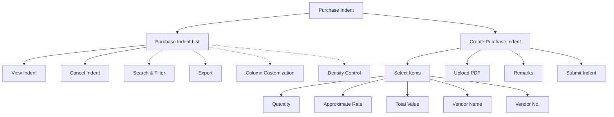

# Purchase Indent

A **Purchase Indent** in Acharya ERP is an official internal request raised by a department to initiate the purchase of goods or services that are not available in current stock or are required in bulk. This module allows users to create, view, and manage purchase indents, track their approval status, and maintain a record of all purchase requests.

---

## Key Features

- **View Purchase Indents:** See a list of all purchase indents with details such as indent number, date, item, quantity, approximate rate, total value, vendor, ticket status, creator, approver, and approved date.
- **Create Purchase Indent:** Initiate a new purchase indent by selecting required items, specifying quantities, approximate rates, vendor details, and uploading supporting documents (PDF).
- **Track Status:** Monitor the approval status of each indent (e.g., Pending, Approved).
- **Cancel Indent:** Cancel a purchase indent if it is no longer required.
- **Search, Filter, and Export:** Use advanced tools to search, filter, and export purchase indent data.
- **Column Customization & Density:** Adjust visible columns and table density for better readability.

---

## Architecture Diagram

- The main view displays all purchase indents with their details and actions (cancel, view).
- Users can create a new purchase indent by selecting items, specifying quantity, rate, vendor details, uploading a PDF, and adding remarks.
- Features such as search, filter, export, column customization, and density control are available for efficient management.

---

## Functional Flow

1. **View Purchase Indents:**  
   Access the list of all purchase indents, with fields such as indent number, date, item, quantity, rate, vendor, status, and actions.

2. **Create Purchase Indent:**  
   Click "Create," select the required items, enter quantity, approximate rate, vendor details, upload supporting PDF, add remarks, and submit the indent.

3. **Cancel Indent:**  
   Use the cancel action to void an indent that is no longer needed.

4. **Search, Filter, and Export:**  
   Use search and filter tools to quickly find specific indents. Export the list as needed.

---

## Field Specifications

| Field            | Description                                  |
| ---------------- | -------------------------------------------- |
| Indent No        | Unique identifier for the purchase indent    |
| Indent Date      | Date the indent was created                  |
| Item             | Name of the requested item                   |
| Quantity         | Quantity requested                           |
| Approximate Rate | Estimated rate per item                      |
| Total Value      | Total estimated value of the indent          |
| Vendor           | Suggested vendor name                        |
| Vendor No.       | Vendor contact number                        |
| Ticket Status    | Status of the indent (Pending/Approved/etc.) |
| Created By       | User who created the indent                  |
| Approver         | Name of the approver                         |
| Approved Date    | Date the indent was approved                 |
| PDF Upload       | Supporting document (PDF, less than 2MB)     |
| Remarks          | Additional comments or notes                 |
| Actions          | View or cancel indent                        |
