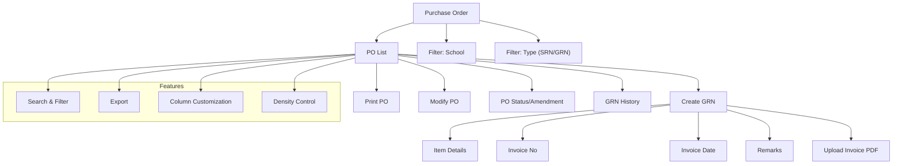

# Purchase Order

The **Purchase Order** section in Acharya ERP allows users to view, manage, and process purchase orders (POs) for inventory items. Users can filter POs by school and type (SRN/GRN), print purchase orders, modify PO details, and create Goods Receive Notes (GRN) once items are received from vendors.

---

## Key Features

- **View Purchase Orders:** See a list of all purchase orders with details such as institute, approved date, vendor, PO number, PO amount, PO type (SRN/GRN), and creator.
- **Filter by School and Type:** Filter POs based on school and PO type (SRN/GRN) for focused management.
- **Print Purchase Order:** Print or download the PO as a PDF for documentation and processing.
- **Modify Purchase Order:** Edit and update PO details as needed before finalization.
- **Create GRN:** After receiving items from the vendor, create a Goods Receive Note by entering item details, invoice number, invoice date, remarks, and uploading the invoice PDF.
- **Track PO Status:** View PO status, amendments, and GRN creation history.
- **Search, Filter, and Export:** Use advanced tools to search, filter, and export PO data.
- **Column Customization & Density:** Adjust visible columns and table density for better readability.

---

## Architecture Diagram

- The main view displays a list of all purchase orders, with options to print, modify, and create GRN.
- Users can filter POs by school and type (SRN/GRN).
- Creating a GRN involves entering item details, invoice number, invoice date, remarks, and uploading the invoice PDF.
- Features such as search, filter, export, column customization, and density control are available for efficient management.

---

## Functional Flow

1. **View and Filter Purchase Orders:**  
   Access the list of all POs and filter by school and PO type (SRN/GRN).

2. **Print or Modify PO:**  
   Print the PO as a PDF or update PO details as needed.

3. **Create Goods Receipt Note (GRN):**  
   After receiving items from the vendor, click "Create GRN" and enter:

   - Item details (name, quantity, rate, balance qty, enter qty, description)
   - Invoice number and date
   - Remarks
   - Upload the invoice PDF (max 2MB)
   - Submit to record the GRN

4. **Track PO and GRN Status:**  
   View PO status, amendments, and GRN creation history.

5. **Search, Filter, and Export:**  
   Use search and filter tools to quickly find specific POs. Export the list as needed.

---

## Field Specifications

| Field          | Description                             |
| -------------- | --------------------------------------- |
| Institute      | Name of the institute/school            |
| Approved Date  | Date the PO was approved                |
| Vendor         | Vendor name                             |
| PO No          | Purchase order number                   |
| PO Amount      | Total amount of the purchase order      |
| PO Type        | Type of PO (SRN/GRN)                    |
| Print PO       | Option to print/download the PO         |
| Amend PO       | Indicates if the PO has been amended    |
| Create GRN     | Action to create a Goods Receipt Note   |
| Created By     | User who created the PO                 |
| Item Details   | Name, quantity, rate, balance qty, etc. |
| Invoice No     | Invoice number for the received items   |
| Invoice Date   | Date of the invoice                     |
| Remarks        | Additional comments                     |
| Upload Invoice | Upload invoice PDF (max 2MB)            |
| GRN History    | Record of all GRNs created for the PO   |
