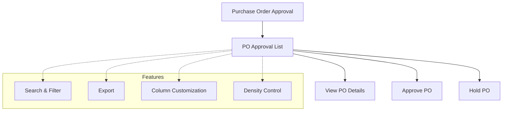

# Purchase Order Approval

The **Purchase Order Approval** section in Acharya ERP allows authorized users to review, hold, or approve purchase orders (POs) submitted for approval. This module provides a list of all pending purchase orders, with options to view PO details, review supporting information, and take action (approve or hold) as required.

---

## Key Features

- **View Purchase Orders:** See a list of all purchase orders awaiting approval, with details such as created date, created by, vendor, total amount, and draft PO.
- **View PO Details:** Open and review the full purchase order before making a decision.
- **Approve or Hold PO:** Approve the purchase order for further processing or place it on hold for review or clarification.
- **Search, Filter, and Export:** Use advanced tools to search, filter, and export PO approval data.
- **Column Customization & Density:** Adjust visible columns and table density for better readability.

---

## Architecture Diagram

- The main view displays a list of all purchase orders pending approval.
- Users can view PO details, then choose to approve or hold the PO.
- Features such as search, filter, export, column customization, and density control are available for efficient management.

---

## Functional Flow

1. **View PO Approval List:**  
   Access the list of all purchase orders awaiting approval, with key details for each PO.

2. **Review PO Details:**  
   Click the view icon to open and review the full purchase order.

3. **Approve or Hold PO:**

   - Click "Approve" to approve the PO for further processing.
   - Click "Hold" to place the PO on hold for further review or clarification.

4. **Search, Filter, and Export:**  
   Use search and filter tools to quickly find specific POs. Export the list as needed for reporting.

---

## Field Specifications

| Field             | Description                             |
| ----------------- | --------------------------------------- |
| Created Date      | Date the PO was created                 |
| Created By        | User who created the PO                 |
| Vendor            | Vendor name                             |
| Total Amount      | Total amount of the purchase order      |
| Draft PO          | Option to view the draft purchase order |
| Purchase Approver | Name of the approver                    |
| Accounts          | Accounts user assigned                  |
| Comparative Quote | Option to view comparative quote        |
| Approve           | Action to approve the PO                |
| Hold              | Action to hold the PO                   |
