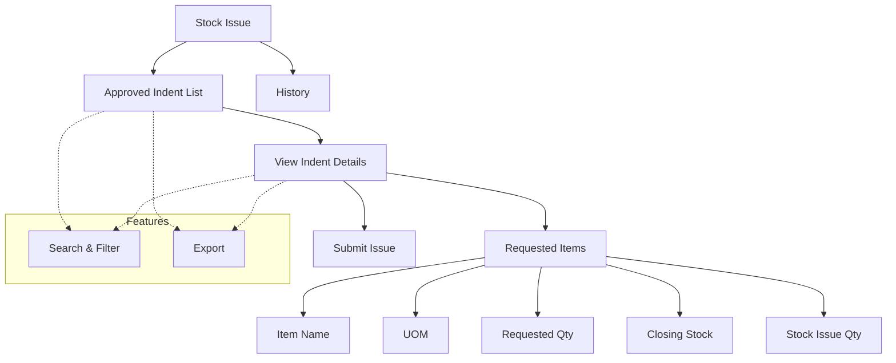

# Stock Issue

The **Stock Issue** section in Acharya ERP allows inventory managers to process and issue items against approved store indent requests. Users can view all approved indents, select items to issue, specify the quantity to be issued for each item, and complete the stock issue process. This module ensures accurate tracking of inventory movement and supports efficient internal distribution of materials.

---

## Key Features

- **View Approved Indents:** See a list of all approved store indent requests, including indent ticket, date, requester, and approver.
- **Select Items for Issue:** For each approved indent, view the list of requested items, their UOM, requested quantity, and available closing stock.
- **Specify Issue Quantity:** Enter the quantity to be issued for each item, ensuring it does not exceed the available stock.
- **Partial or Full Issue:** Issue all or only selected items/quantities as required.
- **Submit Stock Issue:** Complete the stock issue process and update inventory records.
- **Search, Filter, and Export:** Use advanced tools to search, filter, and export stock issue data for reporting or audit purposes.
- **History:** View the history of stock issues for traceability.

---

## Architecture Diagram

- The main view displays all approved store indent requests.
- For each indent, users can view item details, available stock, and specify the quantity to issue.
- The stock issue is submitted and inventory records are updated accordingly.
- Features such as search, filter, export, and history are available for efficient management and traceability.

---

## Functional Flow

1. **View Approved Indents:**  
   Access the list of all approved store indent requests.

2. **Select Items and Specify Issue Quantity:**  
   For each indent, view the requested items, check available stock, and enter the quantity to be issued for each item.

3. **Submit Stock Issue:**  
   Confirm and submit the stock issue to update inventory records.

4. **Search, Filter, and Export:**  
   Use search and filter tools to quickly find specific indents or stock issues. Export data as needed.

5. **View History:**  
   Review the history of all stock issues for audit and tracking.

---

## Field Specifications

| Field           | Description                                  |
| --------------- | -------------------------------------------- |
| Indent Ticket   | Unique identifier for the indent request     |
| Indent Date     | Date the indent was created                  |
| Requested By    | Name of the user/department requesting items |
| Approver        | Name of the approver                         |
| Item Name       | Name of the item to be issued                |
| UOM             | Unit of Measurement for the item             |
| Requested Qty   | Quantity requested in the indent             |
| Closing Stock   | Available stock before issue                 |
| Stock Issue Qty | Quantity being issued                        |
| Actions         | Issue, view, or update stock issue           |
