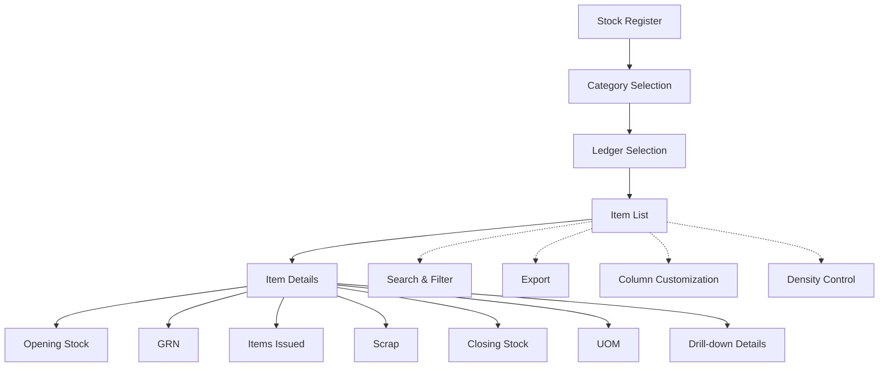

# Stock Register

The **Stock Register** module in Acharya ERP provides a comprehensive overview of all inventory stocks, categorized by Fixed Assets, Expenditure, Repair and Maintenance, Student Development Expenses, and Current Liability. This section enables users to monitor stock movements, including goods received (GRN), items issued, scrap, and closing stock, across various ledgers and categories.

---

## Key Features

- **Category-wise Stock View:** View stock information grouped by categories such as Fixed Assets, Expenditure, Repair and Maintenance, Student Development Expenses, and Current Liability.
- **Ledger Selection:** Filter and view stock data by selecting specific ledgers within each category (e.g., Electrical Fitting, Printing & Stationery).
- **Stock Movement Tracking:** Track opening stock, GRN (goods received), items issued, scrap, and closing stock for each item.
- **Detailed Item Information:** View item name, description, UOM (unit of measurement), and all stock movement details.
- **Drill-down Details:** Click on GRN, items issued, or closing stock to view detailed transaction history for each item.
- **Search, Filter, and Export:** Use advanced tools to search, filter, and export stock register data for reporting or reconciliation.
- **Column Customization & Density:** Adjust visible columns and table density for better readability.

---

## Architecture Diagram

- The main view starts with **Category Selection** (Fixed Assets, Expenditure, etc.).
- Within each category, users select a **Ledger** to view the corresponding **Item List**.
- Each item displays details such as opening stock, GRN, items issued, scrap, closing stock, and UOM.
- Users can drill down into GRN, items issued, or closing stock for transaction-level details.
- Features like search, filter, export, column customization, and density control are available for efficient management.

---

## Functional Flow

1. **Select Category and Ledger:**  
   Choose a stock category and select the desired ledger to display the item list.

2. **View Stock Details:**  
   Review opening stock, GRN, items issued, scrap, closing stock, and UOM for each item.

3. **Drill-down for Details:**  
   Click on GRN, items issued, or closing stock to view detailed transaction history for the selected item.

4. **Search, Filter, and Export:**  
   Use search and filter tools to quickly find specific items or transactions. Export data as needed.

5. **Customize View:**  
   Adjust columns and table density for better readability.

---

## Field Specifications

| Field            | Description                                 |
| ---------------- | ------------------------------------------- |
| Item Name        | Name of the inventory item                  |
| Item Description | Description of the item                     |
| Opening Stock    | Quantity at the start of the period         |
| GRN              | Quantity received (Goods Receipt Note)      |
| Items Issued     | Quantity issued from stock                  |
| Scrap            | Quantity marked as scrap                    |
| Closing Stock    | Quantity remaining at the end of the period |
| UOM              | Unit of Measurement (e.g., Number, Box)     |

Review opening stock, GRN, items issued, scrap, closing stock, and UOM for each item.

3. **Drill-down for Details:**  
   Click on GRN, items issued, or closing stock to view detailed transaction history for the selected item.

4. **Search, Filter, and Export:**  
   Use search and filter tools to quickly find specific items or transactions. Export data as needed.

5. **Customize View:**  
   Adjust columns and table density for better readability.

---

## Field Specifications

| Field            | Description                                 |
| ---------------- | ------------------------------------------- |
| Item Name        | Name of the inventory item                  |
| Item Description | Description of the item                     |
| Opening Stock    | Quantity at the start of the period         |
| GRN              | Quantity received (Goods Receipt Note)      |
| Items Issued     | Quantity issued from stock                  |
| Scrap            | Quantity marked as scrap                    |
| Closing Stock    | Quantity remaining at the end of the period |
| UOM              | Unit of Measurement (e.g., Number, Box)     |
