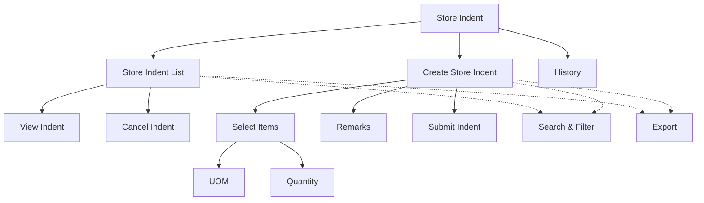

# Store Indent

The **Store Indent** section in Acharya ERP allows departments to formally request items or materials from the central store or inventory unit. Users can view all store indent requests, create new indents by selecting required items and quantities, and cancel indents that are no longer needed. This module streamlines internal requisition processes and ensures efficient inventory management.

---

## Key Features

- **View Store Indent Requests:** See a list of all store indent requests with details such as indent ticket, indent date, requested by, approver status, and actions.
- **Create Store Indent:** Initiate a new store indent by selecting item names, units of measurement (UOM), and required quantities. Multiple items can be requested in a single indent.
- **Cancel Store Indent:** Cancel an existing indent if it is not required.
- **Search, Filter, and Export:** Quickly locate specific indents using search and filter tools. Export indent data for reporting or record-keeping.
- **Validity:** Indents are valid for a fixed period (e.g., 7 days) from the date of creation.
- **History:** View the history of store indent requests and actions taken.

---

## Architecture Diagram

- The main view displays all store indent requests with details and available actions (view, cancel).
- Users can create a new store indent by selecting one or more items, specifying UOM and quantity, and adding remarks.
- Indents can be cancelled if not required.
- Features such as search, filter, export, and history are available for efficient management and tracking.

---

## Functional Flow

1. **View Store Indent Requests:**  
   Access the list of all store indent requests, with fields such as indent ticket, date, requester, status, and actions.

2. **Create Store Indent:**  
   Click "Create," select the required items, UOM, and quantity for each, add remarks if needed, and submit the indent.

3. **Cancel Indent:**  
   Use the cancel action to void an indent that is no longer needed.

4. **Search, Filter, and Export:**  
   Use search and filter tools to quickly find specific indents. Export the list as needed.

5. **View History:**  
   Review the history of all indents and actions performed.

---

## Field Specifications

| Field           | Description                                  |
| --------------- | -------------------------------------------- |
| Indent Ticket   | Unique identifier for the indent request     |
| Indent Date     | Date the indent was created                  |
| Requested By    | Name of the user/department requesting items |
| Approver Status | Status of approval (Pending/Approved/etc.)   |
| Item Name       | Name of the requested item                   |
| UOM             | Unit of Measurement for the item             |
| Quantity        | Quantity requested                           |
| Remarks         | Additional comments or notes                 |
| Actions         | View or cancel indent                        |
| Validity        | Expiry date or validity period               |
