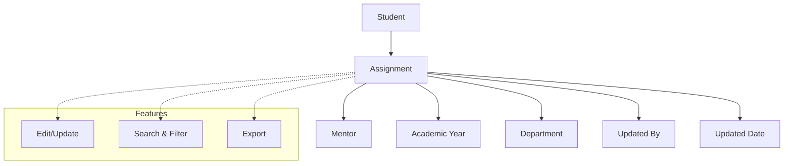

# Mentor Assignment

The **Mentor Assignment** section in Acharya ERP allows administrators to assign mentors to students and view the list of students along with their respective mentors. This ensures that every student is connected to a faculty mentor for academic and personal guidance.

---

## Key Features

- **Assign Mentor:** Assign a faculty or staff member as a mentor to individual students or groups based on the selected Academic Year, School, and Program.
- **View Assignments:** See a comprehensive list of students with their assigned mentors.
- **Edit or Update Assignments:** Change mentor assignments as needed.
- **Search & Filter:** Quickly locate students or mentors using search and filter tools.
- **Export:** Export mentor-student assignment data for reporting or analysis.

---

## Architecture Diagram

- **Student** is linked to a **Mentor** through an **Assignment** record.
- Each assignment includes academic year, department, updated by, and updated date.
- **Features** such as edit/update, search & filter, and export are available for efficient management and reporting.

---

## Functional Flow

1. **Assign Mentor:**

   - Select a student or group of students.
   - Choose a mentor from the list of available faculty/staff.
   - Submit to assign the mentor.

2. **View Mentor Assignments:**

   - Access the list of all students with their assigned mentors.
   - Use filters to search by student, mentor, academic year, or department.

3. **Edit or Update Assignment:**

   - Change the assigned mentor for a student as required.

4. **Export Assignments:**
   - Export the assignment list for reporting or record-keeping.

---

## Field Specifications

| Field         | Type   | Required | Description                       |
| ------------- | ------ | -------- | --------------------------------- |
| Student Name  | Text   | Yes      | Name of the student               |
| Student ID    | Text   | Yes      | Unique identifier for the student |
| Mentor Name   | Text   | Yes      | Name of the assigned mentor       |
| Mentor ID     | Text   | Yes      | Unique identifier for the mentor  |
| Academic Year | Select | Yes      | Academic year of the assignment   |
| Department    | Select | No       | Department of the student/mentor  |
| Updated By    | Text   | Auto     | User who made the assignment      |
| Updated Date  | Date   | Auto     | Date of assignment or update      |
