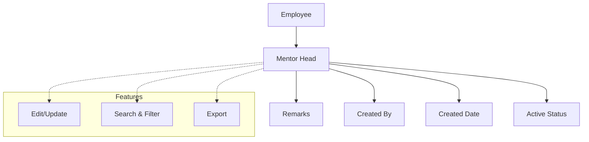

# Mentor Head

The Mentor Head section enables institutions to view all mentor heads and assign employees as mentors head. With features for tracking, updating, searching, filtering, and exporting mentor head data, this module ensures structured and accountable mentorship management for student support.

---

## Key Features

- **Mentor Head Management:** View and manage the list of all mentor heads.
- **Assign Employee as Mentor Head:** Assign faculty or staff as mentor heads with relevant remarks.
- **Track Creation and Status:** View who created each mentor head entry, creation date, and active status.
- **Edit and Update:** Update mentor head details as needed.
- **Search, Filter, and Export:** Use advanced tools to search, filter, and export mentor head data.

---

## Architecture Diagram

- **Employee** can be assigned as a **Mentor Head**.
- Each **Mentor Head** record includes remarks, creator, creation date, and active status.
- **Features** such as edit/update, search & filter, and export are available for efficient management and reporting.

---

## Functional Flow

1. **View Mentor Heads:**  
   Access the list of all mentor heads, including their names, remarks, creator, creation date, and status.

2. **Assign Employee as Mentor Head:**  
   Click "Create" to assign a new employee as a mentor head. Enter the mentor head name and remarks, then submit.

3. **Edit or Update:**  
   Update mentor head details or status as required.

4. **Search, Filter, and Export:**  
   Use the available tools to filter the list or export data for reporting.

---

## Field Specifications

| Field        | Type   | Required | Description                       |
| ------------ | ------ | -------- | --------------------------------- |
| Mentor Head  | Select | Yes      | Name of the employee as mentor    |
| Remarks      | Text   | Yes      | Additional remarks or designation |
| Created By   | Text   | Auto     | User who created the entry        |
| Created Date | Date   | Auto     | Date of creation                  |
| Update       | Action | No       | Edit mentor head details          |
| Active       | Bool   | Yes      | Indicates if the mentor is active |

---

This module provides a structured and transparent approach to assigning and managing mentor heads, supporting student success through effective mentorship.
