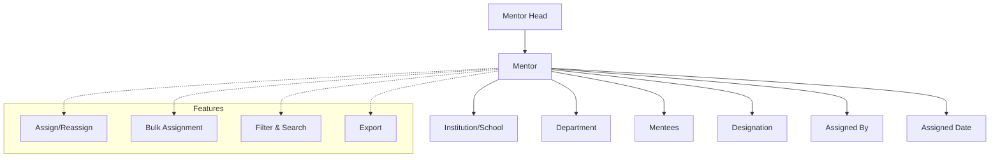

# Mentor Head Assignment

The **Mentor Head Assignment** section in Acharya ERP displays the list of mentors along with their respective mentor heads. Administrators can assign or reassign mentor heads to mentors, either individually or in bulk, and filter the list by school and department for efficient management.

---

## Key Features

- **View Mentor-Head Mapping:** See a comprehensive list of mentors and their assigned mentor heads.
- **Assign/Reassign Mentor Head:** Assign or change the mentor head for any mentor as needed.
- **Bulk Assignment:** Auto-assign all employees of a department to the mentor head of that department.
- **Filter & Search:** Filter the list by school and department, and search for specific mentors or mentor heads.
- **Export:** Export the mentor-head assignment data for reporting or analysis.

---

## Architecture Diagram

### Architecture Explanation

- **Mentor Head** is assigned to one or more **Mentors**.
- Each **Mentor** is linked to institution/school, department, mentees, designation, assigned by, and assigned date.
- **Features** such as assign/reassign, bulk assignment, filter & search, and export are available for efficient management and reporting.

---

## Functional Flow

1. **View Mentor-Head List:**

   - Access the list of all mentors with their current mentor head, institution, department, mentee count, designation, assigned by, assigned date, and update options.

2. **Assign or Reassign Mentor Head:**

   - Select one or more mentors and assign or reassign their mentor head using the assignment dialog.
   - Optionally, use the "De-Assign and Re-Assign" feature for bulk updates.

3. **Auto-Assign by Department:**

   - Automatically assign all employees of a department to the mentor head of that department.

4. **Filter & Export:**
   - Use school and department filters to narrow down the list.
   - Export the assignment data as needed.

---

## Field Specifications

| Field         | Type   | Description                              |
| ------------- | ------ | ---------------------------------------- |
| Mentor Head   | Text   | Name of the assigned mentor head         |
| Mentor        | Text   | Name of the mentor                       |
| Institution   | Text   | Institution/School name                  |
| Department    | Text   | Department name                          |
| Mentees       | Number | Number of mentees assigned to the mentor |
| Designation   | Text   | Designation of the mentor                |
| Assigned By   | Text   | User who performed the assignment        |
| Assigned Date | Date   | Date of assignment                       |
| Update        | Action | Edit or update mentor head assignment    |
