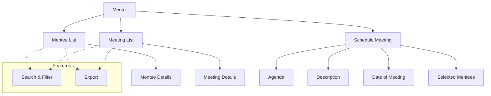

# My Mentee

The **My Mentee** section in Acharya ERP provides mentors with a centralized dashboard to view all students (mentees) assigned to them. Mentors can also see the complete list of meetings scheduled with their mentees and have the option to schedule new meetings directly from this section.

---

## Key Features

- **View Assigned Mentees:** See a list of all students assigned to the mentor, with details such as name, AUID, USN, year/semester, reporting date, and assignment history.
- **Meeting List:** Access a comprehensive list of all meetings scheduled with mentees, including meeting type, agenda, date, and feedback status.
- **Schedule Meeting:** Quickly schedule new meetings with one or more mentees, specifying agenda, description, and meeting date.
- **Search, Filter, and Export:** Use advanced tools to search, filter, and export mentee or meeting data for reporting or analysis.

---

## Architecture Diagram

### Architecture Explanation

- **Mentor** has access to a **Mentee List** and a **Meeting List**.
- **Mentee List** shows all assigned students with their details.
- **Meeting List** displays all scheduled meetings with mentees.
- **Schedule Meeting** allows the mentor to set agenda, description, date, and select mentees for the meeting.
- **Features** such as search, filter, and export are available for both mentee and meeting data.

---

## Functional Flow

1. **View Assigned Mentees:**  
   Access the list of all mentees assigned to the mentor, with relevant academic and assignment details.

2. **View Meeting List:**  
   Review all meetings scheduled with mentees, including meeting type, agenda, date, and feedback status.

3. **Schedule Meeting:**  
   Use the "Schedule Meeting" option to set up a new meeting with one or more mentees, specifying agenda, description, and date.

4. **Search, Filter, and Export:**  
   Utilize search and filter tools to quickly find specific mentees or meetings, and export data as needed.

---

## Field Specifications

### Mentee List

| Field                      | Description                   |
| -------------------------- | ----------------------------- |
| Name                       | Name of the mentee            |
| AUID                       | Student's unique ID           |
| USN                        | University Serial Number      |
| Year/Sem                   | Academic year and semester    |
| Reporting Date             | Date when mentee was assigned |
| Assigned By                | User who assigned the mentee  |
| Assigned Date              | Date of assignment            |
| IVR/Email/WhatsApp History | Communication history         |

### Meeting List

| Field          | Description              |
| -------------- | ------------------------ |
| Meeting Type   | Type of meeting (agenda) |
| Proctor        | Name of the mentor       |
| Student        | Name of the mentee       |
| AUID           | Student's unique ID      |
| Meeting Agenda | Agenda of the meeting    |
| Meeting Date   | Date of the meeting      |
| MOM            | Minutes of Meeting       |
| Give Feedback  | Feedback option/status   |
| Feedback Date  | Date feedback was given  |

### Schedule Meeting

| Field           | Description                          |
| --------------- | ------------------------------------ |
| Agenda          | Purpose of the meeting               |
| Description     | Additional details about the meeting |
| Date of Meeting | Scheduled date for the meeting       |
| Students        | Selected mentees for the meeting     |
