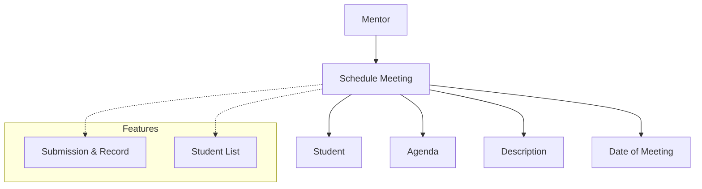

# Schedule Meeting

The **Schedule Meeting** section in Acharya ERP allows mentors to schedule and record meetings with their assigned students. This feature helps mentors formally document interactions, track meeting agendas, and monitor student progress over time.

---

## Key Features

- **Schedule Meetings:** Set up meetings between mentors and their assigned students.
- **Agenda Selection:** Choose from predefined agendas (e.g., IA marks review, attendance review, discipline matter, academic issues, leave issues, fee due, monthly meeting, others).
- **Add Description:** Provide additional details or context for the meeting.
- **Set Meeting Date:** Specify the date of the meeting.
- **Student List:** View and select students under the mentor for the meeting.
- **Submission & Record:** Submit and maintain a record of all scheduled meetings.

---

## Architecture Diagram

- **Mentor** schedules meetings via the **Schedule Meeting** entity.
- Each meeting is linked to one or more **Students**, an **Agenda**, a **Description**, and a **Date of Meeting**.
- **Features** include maintaining a student list and submission/record of meetings for tracking and reporting.

---

## Functional Flow

1. **Select Agenda:**  
   Choose the agenda of the meeting from the dropdown list.

2. **Enter Description:**  
   Add a description or notes relevant to the meeting.

3. **Set Date:**  
   Select the date for the meeting.

4. **Select Students:**  
   Choose students under the mentor to include in the meeting (if available).

5. **Submit Meeting:**  
   Save the meeting details for future reference and reporting.

---

## Field Specifications

| Field           | Type        | Required | Description                              |
| --------------- | ----------- | -------- | ---------------------------------------- |
| Agenda          | Select      | Yes      | Purpose of the meeting                   |
| Description     | Text        | Yes      | Additional details about the meeting     |
| Date of Meeting | Date        | Yes      | Scheduled date for the meeting           |
| Students        | MultiSelect | Yes      | Students under the mentor (if available) |
