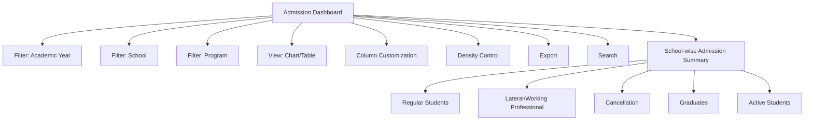

# Admission Dashboard

The **Admission Dashboard** in Acharya ERP provides a comprehensive overview of student admissions across the institution. It displays key admission metrics grouped by school, including the number of regular students, lateral/working professional entries, cancellations, graduates, and active students. The dashboard supports both chart and table views, and offers advanced filtering, export, and customization options for efficient data analysis.

---

## Key Features

- **School-wise Admission Summary:** View admission statistics for each school, including regular, lateral/working professional, cancellations, graduates, and active students.
- **Interactive Views:** Switch between chart and table views for visual or tabular analysis.
- **Advanced Filtering:** Filter data by academic year, school, program, and other parameters.
- **Column Customization:** Show or hide columns as needed for focused analysis.
- **Density Control:** Adjust table density for better readability.
- **Export:** Export admission data for reporting or further analysis.
- **Search:** Quickly locate schools or students using the search bar.

---

## Architecture Diagram

### Architecture Explanation

- The dashboard aggregates admission data by school, showing counts for regular, lateral/working professional, cancellations, graduates, and active students.
- Users can filter data by academic year, school, and program.
- The view can be toggled between chart and table formats.
- Additional features include column customization, density control, export, and search for efficient data management.

---

## Functional Flow

1. **Select Filters:**  
   Choose academic year, school, and program to refine the admission data displayed.

2. **View Admission Summary:**  
   Review the summary table or chart showing admission counts by school and category.

3. **Customize View:**  
   Adjust columns, table density, and switch between chart/table views as needed.

4. **Search and Export:**  
   Use the search bar to quickly find specific schools or students. Export the data for reporting or analysis.

---

## Field Specifications

| Field           | Description                                      |
|-----------------|--------------------------------------------------|
| School          | Name of the school/institute                     |
| Regular         | Number of regular student admissions             |
| Lateral/WP      | Number of lateral/working professional entries   |
| Cancellation    | Number of cancelled admissions                   |
| Graduates       | Number of students who have graduated            |
| Active          | Number of currently active students              |

---

This dashboard provides a centralized and interactive view of admissions, supporting data-driven decision-making and institutional planning.
