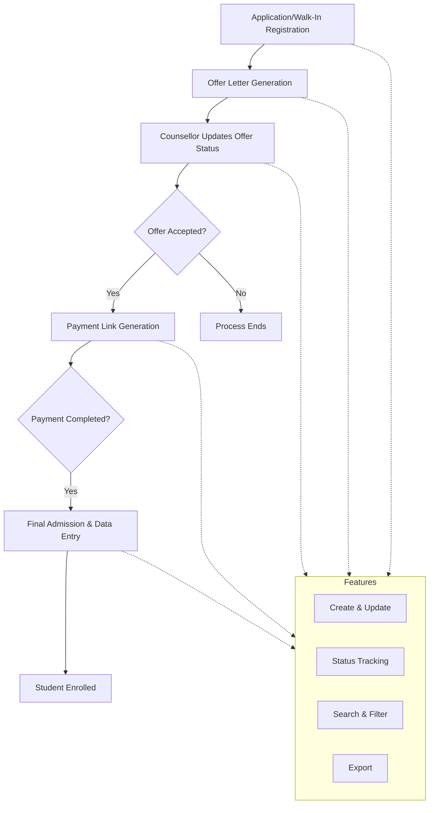

import { Callout } from 'nextra/components';

# Admission Process

The **Admission Process** module at Acharya Institute orchestrates the complete student onboarding workflow, from initial offer to final admission. This structured process ensures transparency, accountability, and efficiency for both applicants and administrative staff.

---

## Process Overview

The admission process consists of the following key stages:

1. **Offer Letter Generation:**  
   After a candidate applies or walks in, the admissions team reviews the application and generates an official offer letter. This letter outlines the program, school, academic year, admission category, and fee template.

2. **Offer Status Update by Counsellor:**  
   The assigned counsellor communicates the offer to the candidate and updates the system with the candidate's response (Accepted/Rejected). Remarks can be added for additional context.

3. **Payment Link Generation:**  
   Upon acceptance of the offer, the system automatically generates a secure payment link for the candidate. This link enables the candidate to pay the required admission or program fees online.

4. **Final Admission & Data Entry:**  
   Once payment is confirmed, the candidate proceeds to the final admission stage. Here, all required details—including personal, academic, address, bank, and document information—are captured in the system, completing the admission process.

---

## Architecture

The following diagram illustrates the sequential flow of the admission process, highlighting the key interactions and data transitions at each stage.

---

## Stage Details

### 1. Offer Letter Generation

- Candidate's application is reviewed.
- Offer letter is generated with program, school, academic year, admission category, and fee template.
- Offer letter is communicated to the candidate.

### 2. Offer Status Update by Counsellor

- Counsellor updates the system with the candidate's response (Accepted/Rejected).
- Remarks can be added for context.
- Only accepted offers proceed to the next stage.

### 3. Payment Link Generation

- Upon acceptance, a payment link is generated and shared with the candidate.
- Candidate completes the payment online.

### 4. Final Admission & Data Entry

- After payment confirmation, the candidate is prompted to complete the admission form.
- All required details are entered, including:

  - Personal Details
  - Additional Information (Parent/Guardian)
  - Address (Permanent, Correspondence, Local)
  - Bank Details
  - Academic Background
  - Program Details
  - Document Collection

- Admission is finalized and the student is officially enrolled.

---

## Field Specifications

### Offer Letter

| Field                 | Type    | Required | Description                                 |
| --------------------- | ------- | -------- | ------------------------------------------- |
| Student Name          | Text    | Yes      | Name of the candidate                       |
| Program               | Select  | Yes      | Program offered                             |
| School                | Select  | Yes      | School offering the program                 |
| Academic Year         | Select  | Yes      | Academic year of admission                  |
| Admission Category    | Select  | Yes      | Admission category (e.g., Management Quota) |
| Admission Subcategory | Select  | Yes      | Admission sub-category                      |
| Fee Template          | Select  | Yes      | Fee template assigned                       |
| Is NRI                | Boolean | Yes      | Indicates if candidate is NRI               |
| Is Scholarship        | Boolean | Yes      | Indicates if candidate has scholarship      |

### Offer Status

| Field        | Type   | Required | Description                       |
| ------------ | ------ | -------- | --------------------------------- |
| Offer Status | Select | Yes      | Accepted / Rejected               |
| Remarks      | Text   | No       | Additional comments by counsellor |

### Payment

| Field          | Type   | Required | Description             |
| -------------- | ------ | -------- | ----------------------- |
| Payment Link   | URL    | Yes      | Link for online payment |
| Payment Status | Select | Yes      | Paid / Pending          |
| Payment Date   | Date   | No       | Date of payment         |

### Final Admission

Refer to the [Quick Admission](./quick_admission.mdx) documentation for detailed field specifications on personal, academic, address, bank, program, and document information.

---

## Common Features

- **Create, Update, Select:** All records support create, update, and select (read) actions. Delete is not supported.
- **Status Tracking:** Monitor progress at each stage of the admission process.
- **Search & Filter:** Quickly locate and review candidate records.
- **Export:** Export data for reporting or integration purposes.

---
