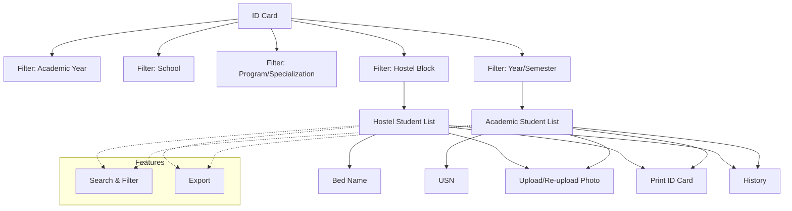

# ID Card

The **ID Card** section in Acharya ERP allows administrators to view, manage, and print student ID cards for both academic programs and hostel accommodations. Users can filter students by academic year, school, program, semester, and hostel block, view ID card details, upload or re-upload student photos, and print ID cards as needed.

---

## Key Features

- **Filter Students:** Select academic year, school, program/specialization, semester, or hostel block to view relevant students.
- **View ID Card Details:** See student details such as AUID, name, USN, year/semester, bed name (for hostel), and photo.
- **Upload/Re-upload Photo:** Upload or update the student's photo for the ID card.
- **Print ID Card:** Print the ID card for individual students or in bulk.
- **Search, Filter, and Export:** Use advanced tools to search, filter, and export ID card data.
- **History Tab:** View the history of ID card prints and uploads.

---

## Architecture Diagram

- The process starts by filtering students by academic year, school, program, semester, or hostel block.
- The resulting student list (academic or hostel) displays all relevant details, including photo and ID card information.
- Administrators can upload/re-upload photos and print ID cards.
- Features such as search, filter, export, and history are available for efficient management.

---

## Functional Flow

1. **Filter Students:**  
   Select the relevant academic year, school, program/specialization, semester, or hostel block to display the student list.

2. **View and Manage ID Cards:**  
   Review student details, upload or update photos, and print ID cards as required.

3. **History and Export:**  
   View the history of ID card prints and uploads. Export data for reporting or record-keeping.

---

## Field Specifications

| Field        | Description                             |
| ------------ | --------------------------------------- |
| AUID         | Acharya Unique ID of the student        |
| Student Name | Name of the student                     |
| USN          | University Serial Number                |
| Year/Sem     | Current year and semester               |
| Bed Name     | Hostel bed name (for hostel students)   |
| Block Name   | Hostel block name (for hostel students) |
| Photo        | Student's photo for the ID card         |
| Upload Photo | Option to upload or re-upload photo     |
| Print        | Option to print the ID card             |
