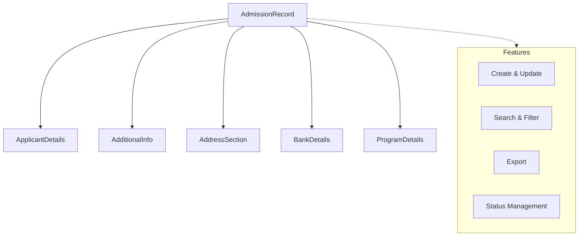

import { Callout } from 'nextra/components';

# Quick Admission

The **Quick Admission** module at Acharya Institute streamlines the student enrollment process by providing a unified, efficient interface for capturing all essential applicant information. This module is designed to reduce administrative effort, ensure data completeness, and accelerate the onboarding of new students.

---

## Architecture

The Quick Admission module integrates multiple data domains—applicant details, additional information, address, bank details, and program details—into a single, cohesive admission record. This structure ensures that all relevant information is captured at the point of entry and is readily available for downstream processes such as verification, reporting, and communication.

**Explanation:**

- **Applicant Details**: Captures core personal information such as name, date of birth, gender, contact details, and demographic data.
- **Additional Information**: Records parent and guardian details, including contact, occupation, qualification, and income.
- **Address**: Supports entry of permanent, correspondence, and local addresses for comprehensive contact information.
- **Bank Details**: Stores banking information required for fee processing and refunds.
- **Program Details**: Collects academic year, school, program, admission category, nationality, fee template, and related data for program allocation.

All sections are logically grouped for clarity and speed, with required fields enforced for data integrity.

---

## Field Specifications

### Applicant Details

| Field            | Type   | Required | Description                |
| ---------------- | ------ | -------- | -------------------------- |
| AUID             | Text   | Yes      | Unique applicant ID        |
| Applicant Name   | Text   | Yes      | Full name of the applicant |
| Date of Birth    | Date   | Yes      | Applicant's date of birth  |
| Gender           | Select | Yes      | Gender (Male/Female)       |
| Mobile No.       | Text   | Yes      | Primary mobile number      |
| Alternate Mobile | Text   | No       | Alternate mobile number    |
| Personal Email   | Text   | No       | Applicant's email address  |
| Caste Category   | Select | No       | Caste category             |
| Blood Group      | Select | No       | Blood group                |
| Religion         | Select | No       | Religion                   |

### Additional Information

| Field                | Type   | Required | Description              |
| -------------------- | ------ | -------- | ------------------------ |
| Father Name          | Text   | No       | Father's name            |
| Father Mobile        | Text   | No       | Father's mobile number   |
| Father Email         | Text   | No       | Father's email           |
| Father Occupation    | Text   | No       | Father's occupation      |
| Father Qualification | Text   | No       | Father's qualification   |
| Father Income        | Number | No       | Father's income          |
| Mother Name          | Text   | No       | Mother's name            |
| Mother Mobile        | Text   | No       | Mother's mobile number   |
| Mother Email         | Text   | No       | Mother's email           |
| Mother Occupation    | Text   | No       | Mother's occupation      |
| Mother Qualification | Text   | No       | Mother's qualification   |
| Mother Income        | Number | No       | Mother's income          |
| Guardian Name        | Text   | No       | Guardian's name          |
| Guardian Mobile      | Text   | No       | Guardian's mobile number |
| Guardian Email       | Text   | No       | Guardian's email         |
| Guardian Occupation  | Text   | No       | Guardian's occupation    |

### Address

| Field   | Type   | Required | Description  |
| ------- | ------ | -------- | ------------ |
| Address | Text   | Yes      | Address line |
| Country | Select | Yes      | Country      |
| State   | Select | Yes      | State        |
| City    | Select | Yes      | City         |
| Pincode | Text   | Yes      | Postal code  |

_Sections: Permanent, Correspondence, Local_

### Bank Details

| Field            | Type | Required | Description                  |
| ---------------- | ---- | -------- | ---------------------------- |
| Bank Name        | Text | No       | Name of the bank             |
| Name As Per Bank | Text | No       | Applicant's name as per bank |
| Account Number   | Text | No       | Bank account number          |
| Branch           | Text | No       | Bank branch                  |
| IFSC Code        | Text | No       | IFSC code                    |
| Aadhaar No.      | Text | No       | Aadhaar number               |

### Program Details

| Field                    | Type   | Required | Description                               |
| ------------------------ | ------ | -------- | ----------------------------------------- |
| Academic Year            | Select | Yes      | Academic year of admission                |
| School                   | Select | Yes      | School to which the applicant is admitted |
| Program                  | Select | Yes      | Program applied for                       |
| Admission Category       | Select | Yes      | Admission category                        |
| Admission Sub-Category   | Select | Yes      | Admission sub-category                    |
| Nationality              | Select | Yes      | Nationality of the applicant              |
| Fee Template             | Select | Yes      | Fee template assigned                     |
| Preferred Name For Email | Text   | Yes      | Name to be used for provisional email     |
| Acharya Mail             | Text   | No       | Official Acharya email (if assigned)      |

---

## Common Features

- **Create, Update, Select:** All records support create, update, and select (read) actions. Delete is not supported.
- **Search & Filter:** Quickly locate admission records using search and filter tools.
- **Export:** Export data for reporting or integration purposes.
- **Status Management:** Track and manage the status of each admission record.

---

---
