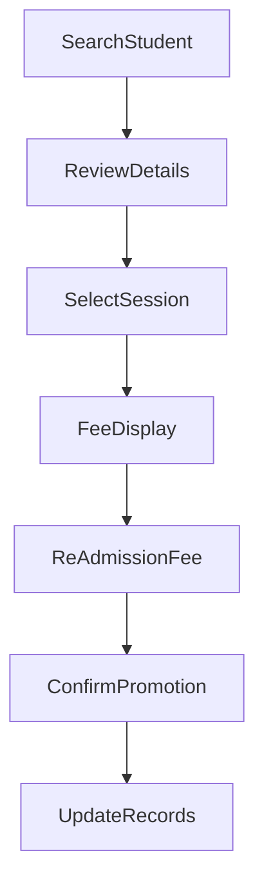

import { Callout } from 'nextra/components';

# Re-Admission

The **Re-Admission** module at Acharya Institute manages the process of promoting students to a new semester or academic session. This ensures that student records, fee structures, and academic progress are accurately updated as students advance in their programs.

---

## Overview

Re-admission is required for students progressing to the next semester or session. The process verifies eligibility, updates academic and fee details, and officially promotes the student to the next stage of their academic journey.

---

## Process Flow

1. **Student Search:**  
   The administrator/counsellor searches for the student using a unique identifier (AUID or USN).

2. **Student & Academic Details Review:**  
   The system displays the student's current details, including program, academic batch, admission category, proctor, and contact information.

3. **Select Academic Year & Semester:**  
   The user selects the new academic year and semester/session to which the student is being promoted.

4. **Fee Template & Structure Display:**  
   The applicable fee template, currency, and admission category are shown. The system displays a detailed fee breakdown for the selected semester/session, including tuition, registration, development, and other fees.

5. **Re-Admission Fee Entry:**  
   If applicable, a re-admission fee can be entered.

6. **Confirmation & Promotion:**  
   After verifying all details, the administrator confirms the re-admission. The student is officially promoted to the new semester/session, and records are updated accordingly.

---

## Architecture

The following diagram illustrates the re-admission workflow.  
**Note:** Node IDs have been updated for compatibility with textmermaid version 11.6.0.

---

## Field Specifications

| Field              | Type   | Required | Description                                      |
| ------------------ | ------ | -------- | ------------------------------------------------ |
| AUID / USN         | Text   | Yes      | Unique student identifier                        |
| Student Name       | Text   | Yes      | Name of the student                              |
| Program            | Text   | Yes      | Program enrolled                                 |
| Academic Batch     | Text   | Yes      | Batch/year of admission                          |
| Current Year/Sem   | Text   | Yes      | Current academic year and semester               |
| Admission Category | Text   | Yes      | Admission category (e.g., Management Quota)      |
| Proctor Name       | Text   | No       | Assigned proctor                                 |
| Acharya Email      | Text   | No       | Official student email                           |
| Mobile No.         | Text   | No       | Student's mobile number                          |
| Academic Year      | Select | Yes      | New academic year for promotion                  |
| Semester           | Select | Yes      | New semester/session for promotion               |
| Fee Template       | Text   | Yes      | Applicable fee template                          |
| Currency           | Text   | Yes      | Fee currency (e.g., INR)                         |
| Fee Details        | Table  | Yes      | Detailed fee breakdown for the selected semester |
| Re-Admission Fee   | Number | No       | Additional re-admission fee (if applicable)      |

---

## Common Features

- **Eligibility Check:** Ensures only eligible students can be promoted.
- **Fee Calculation:** Automatically applies the correct fee structure for the new semester/session.
- **Audit Trail:** Tracks all re-admission actions for compliance and reporting.
- **Status Management:** Updates student status and academic records upon successful re-admission.
- **Search & Filter:** Quickly locate students eligible for re-admission.
- **Export:** Export re-admission data for reporting or integration purposes.

<Callout type="info">
  All actions support create, update, search, filter, and export operations. Delete is not
  supported.
</Callout>

---
