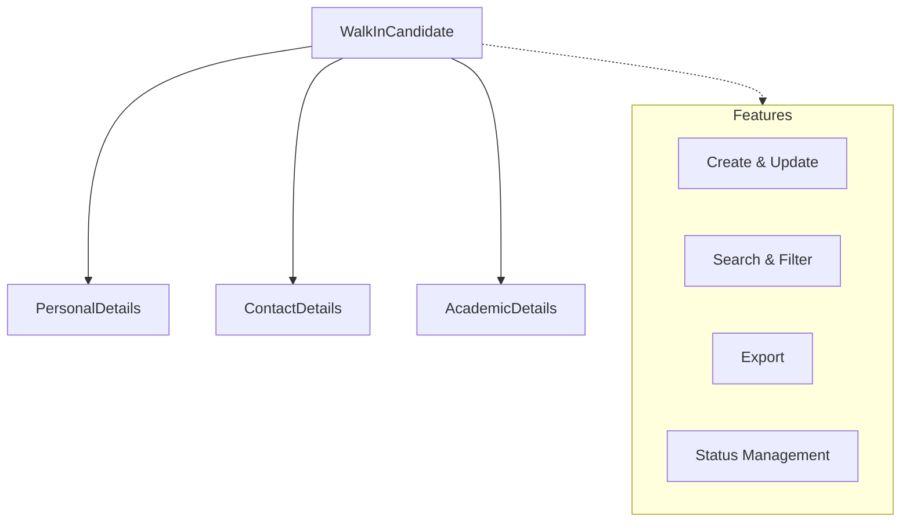

import { Callout } from 'nextra/components';

# Walk-In Candidate Registration

The **Walk-In Candidate Registration** module enables quick and efficient entry of walk-in applicants at Acharya Institute. Designed for front-desk and admissions staff, it streamlines the process of capturing essential candidate information, ensuring a smooth and accurate registration experience.

---

## Architecture

The module captures all required candidate details in a single form, integrating personal, academic, and contact information into a unified record. This structure supports rapid registration and seamless downstream processing.

**Explanation:**

- **Personal Details:** Candidate name, date of birth, gender, and parent/guardian information.
- **Contact Details:** Email address, phone number, and address.
- **Academic Details:** Academic year, school, and program applied for.

All required fields are enforced to ensure data completeness and accuracy.

---

## Field Specifications

| Field          | Type   | Required | Description                                |
| -------------- | ------ | -------- | ------------------------------------------ |
| Candidate Name | Text   | Yes      | Full name of the candidate                 |
| Date of Birth  | Date   | Yes      | Candidate's date of birth                  |
| Gender         | Select | Yes      | Gender (Male/Female)                       |
| Father Name    | Text   | Yes      | Father's name                              |
| Email          | Text   | Yes      | Candidate's email address                  |
| Phone Number   | Text   | Yes      | Candidate's phone number                   |
| Academic Year  | Select | Yes      | Academic year for which candidate applies  |
| School         | Select | Yes      | School to which the candidate is applying  |
| Program        | Select | Yes      | Program to which the candidate is applying |

---

## Common Features

- **Create, Update, Select:** All records support create, update, and select (read) actions. Delete is not supported.
- **Search & Filter:** Quickly locate candidate records using search and filter tools.
- **Export:** Export data for reporting or integration purposes.
- **Status Management:** Track and manage the status of each candidate record.

---
