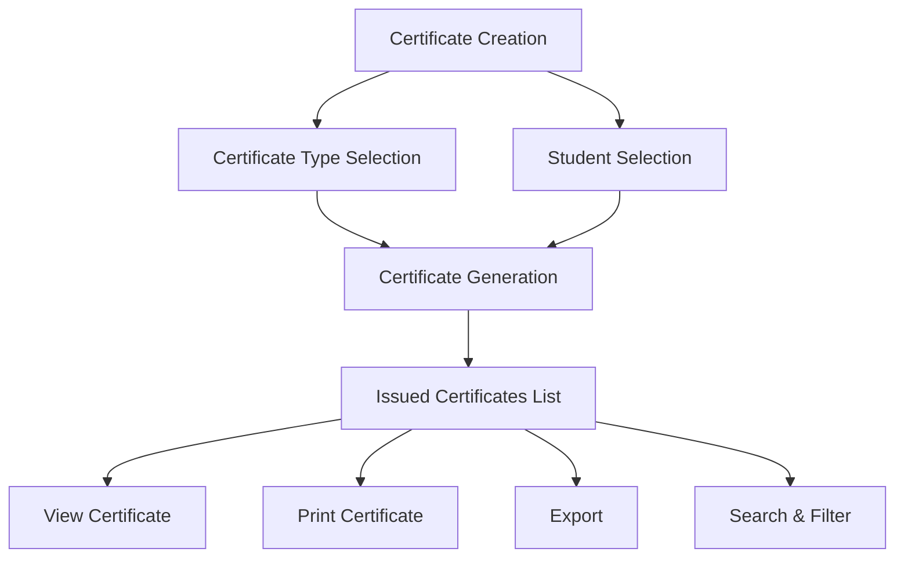

# Certificate Creation

The **Certificate Creation** section in Acharya ERP allows administrators to issue, view, and print various certificates for students. This module supports the creation of multiple certificate types, tracks all issued certificates, and provides tools for searching, filtering, and exporting certificate data.

---

## Key Features

- **Create Certificate:** Generate different types of certificates for students, such as Bonafide Letter, Provisional Bonafide, Character Certificate, Study Certificate, Course Completion Certificate, Internship Bonafide, Medium of Instruction, Passport Bonafide, Police Verification for Passport, and Open Bank Account.
- **View Issued Certificates:** Access a list of all certificates issued to students, with details like reference number, student name, certificate type, created by, and created date.
- **Print Certificate:** View and print any issued certificate directly from the system.
- **Search & Filter:** Quickly locate certificates using search and filter tools.
- **Export:** Export certificate data for reporting or record-keeping.

---

## Architecture Diagram

- **Certificate Creation** starts with selecting the certificate type and student.
- **Certificate Generation** creates the certificate and adds it to the **Issued Certificates List**.
- Administrators can **View** and **Print** certificates, as well as **Search**, **Filter**, and **Export** the list for reporting.

---

## Functional Flow

1. **Create Certificate:**

   - Select the certificate type from the dropdown.
   - Enter the student's AUID.
   - Submit to generate the certificate.

2. **View & Print Certificate:**

   - Access the list of issued certificates.
   - Click the view icon to preview the certificate.
   - Print the certificate as needed.

3. **Search, Filter, and Export:**
   - Use search and filter options to find specific certificates.
   - Export the certificate list for reporting or analysis.

---

## Field Specifications

| Field               | Description                                |
| ------------------- | ------------------------------------------ |
| Reference Number    | Unique identifier for the certificate      |
| AUID                | Student's unique ID                        |
| Student Name        | Name of the student                        |
| Certificate Type    | Type of certificate issued                 |
| Created By          | User who created the certificate           |
| Created Date        | Date the certificate was issued            |
| Hostel Fee Template | Linked hostel fee template (if applicable) |
| View Certificate    | Option to view the certificate             |
| Print Certificate   | Option to print the certificate            |
