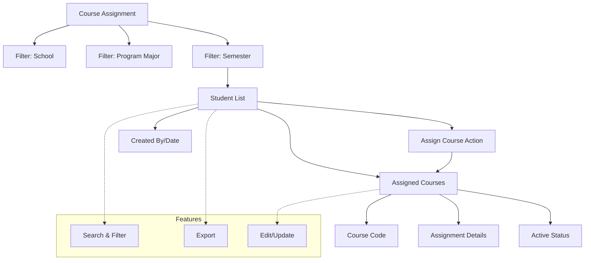

# Course Assignment

The **Course Assignment** section in Acharya ERP allows administrators to view and assign courses to students based on their school, program, and semester. This module streamlines the process of course allocation, ensuring that each student is registered for the correct courses as per their academic structure.

---

## Key Features

- **Filter Students:** Select school, program major, and semester to view the relevant list of students.
- **View Assigned Courses:** See all courses currently assigned to each student, along with course codes and assignment details.
- **Assign Courses:** Assign new courses to individual students or groups of students for the selected semester.
- **Edit or Update Assignments:** Modify course assignments as needed.
- **Search, Filter, and Export:** Use advanced tools to search, filter, and export course assignment data.
- **Audit Trail:** Track who assigned or updated courses and when.

---

## Architecture Diagram

- The process starts by filtering students based on school, program, and semester.
- The resulting **Student List** displays all students and their assigned courses.
- Administrators can assign or update courses for each student.
- Each assignment records the course code, assignment details, active status, and audit information.
- Features such as search, filter, export, and edit/update are available for efficient management.

---

## Functional Flow

1. **Filter Students:**  
   Select the school, program major, and semester to display the relevant student list.

2. **View and Assign Courses:**  
   Review the courses assigned to each student. Use the "Assign" action to add or update course assignments.

3. **Edit or Update Assignments:**  
   Modify existing course assignments as needed.

4. **Search, Filter, and Export:**  
   Use search and filter tools to quickly locate students or courses. Export assignment data for reporting.

---

## Field Specifications

| Field        | Description                           |
| ------------ | ------------------------------------- |
| AUID         | Acharya Unique ID of the student      |
| Student Name | Name of the student                   |
| USN          | University Serial Number              |
| Course       | Name of the assigned course           |
| C-Code       | Course code                           |
| Created By   | User who assigned the course          |
| Created Date | Date of course assignment             |
| Active       | Indicates if the assignment is active |
| Action       | Assign or update course assignment    |
