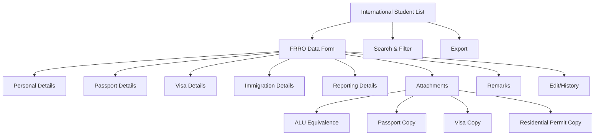

# FRRO Data

The **FRRO Data** section in Acharya ERP manages and displays all Foreigners Regional Registration Office (FRRO) information for international students. This module is essential for tracking and maintaining compliance with Indian immigration regulations, ensuring that all required personal, academic, and visa-related data is accurately recorded and accessible.

---

## Key Features

- **View FRRO Data:** Access a comprehensive list of international students with their FRRO details.
- **Feed/Update FRRO Information:** Enter or update FRRO data for each student using a structured form.
- **Attachments:** Upload and manage supporting documents such as ALU Equivalence, Passport Copy, Visa Copy, and Residential Permit Copy.
- **Search, Filter, and Export:** Quickly locate and export FRRO data for reporting or compliance purposes.
- **Edit and History:** Edit FRRO records and view the history of changes for audit purposes.

---

## Architecture Diagram

- **International Student List** is the main view, with options to search, filter, and export.
- Selecting a student opens the **FRRO Data Form**, where all relevant details can be viewed or updated.
- The form is divided into sections: personal details, passport details, visa details, immigration details, reporting details, attachments, and remarks.
- Attachments include ALU Equivalence, Passport Copy, Visa Copy, and Residential Permit Copy.
- Edit/history functionality allows tracking of changes for compliance.

---

## FRRO Terms Explained

- **AUID:** Acharya Unique ID for the student.
- **Name as per passport:** Student's name exactly as it appears on their passport.
- **Passport No:** Passport number issued by the student's home country.
- **Passport Issue Place/Date:** Location and date where the passport was issued.
- **Passport Expiry Date:** Date when the passport expires.
- **Visa No:** Number of the visa issued for study in India.
- **Visa Type:** Type of visa (e.g., Student, Research).
- **Visa Issue Place/Date:** Location and date where the visa was issued.
- **Visa Expiry Date:** Date when the visa expires.
- **Fsis No:** Foreign Student Information System number.
- **Immigration Date:** Date of entry into India.
- **Port of Arrival/Departure:** Entry and exit points in India.
- **Type of Entry:** Single, Multiple, etc.
- **Issue By:** Authority that issued the visa.
- **Place of Visa Issue:** City/country where the visa was issued.
- **RP No:** Residential Permit number.
- **RP Issue Date/Expiry Date:** Dates of issue and expiry for the residential permit.
- **Reported To India:** Whether the student has reported to Indian authorities (Yes/No).
- **Reported On:** Date when the student reported to Indian authorities.
- **Remarks:** Any additional comments or notes.
- **Attachments:** Supporting documents required for FRRO compliance:
  - **ALU Equivalence:** Document proving academic equivalence.
  - **Passport Copy:** Scanned copy of the passport.
  - **Visa Copy:** Scanned copy of the visa.
  - **Residential Permit Copy:** Scanned copy of the residential permit.

---

## Functional Flow

1. **View FRRO Data:**  
   Access the list of international students and review their FRRO details.

2. **Feed/Update FRRO Information:**  
   Select a student to open the FRRO data form. Enter or update all required fields and upload supporting documents.

3. **Edit and History:**  
   Edit existing FRRO records as needed and view the history of changes for compliance tracking.

4. **Search, Filter, and Export:**  
   Use search and filter tools to find specific records. Export data for reporting or regulatory submission.

---

## Field Specifications

| Field                | Description                                        |
| -------------------- | -------------------------------------------------- |
| AUID                 | Acharya Unique ID                                  |
| Name as per passport | Name as on passport                                |
| Nationality          | Student's nationality                              |
| Passport No          | Passport number                                    |
| Passport Issue Place | Place where passport was issued                    |
| Passport Issue Date  | Date of passport issue                             |
| Passport Expiry Date | Passport expiry date                               |
| Visa No              | Visa number                                        |
| Visa Type            | Type of visa                                       |
| Visa Issue Place     | Place where visa was issued                        |
| Visa Issue Date      | Date of visa issue                                 |
| Visa Expiry Date     | Visa expiry date                                   |
| Fsis No              | Foreign Student Information System number          |
| Immigration Date     | Date of entry into India                           |
| Port of Arrival      | Entry port in India                                |
| Port of Departure    | Exit port in India                                 |
| Type of Entry        | Single/Multiple entry                              |
| Issue By             | Authority issuing the visa                         |
| Place of Visa Issue  | City/country of visa issue                         |
| RP No                | Residential Permit number                          |
| RP Issue Date        | Date of RP issue                                   |
| RP Expiry Date       | RP expiry date                                     |
| Reported To India    | Yes/No                                             |
| Reported On          | Date of reporting to Indian authorities            |
| Remarks              | Additional comments                                |
| Attachments          | ALU Equivalence, Passport Copy, Visa Copy, RP Copy |
