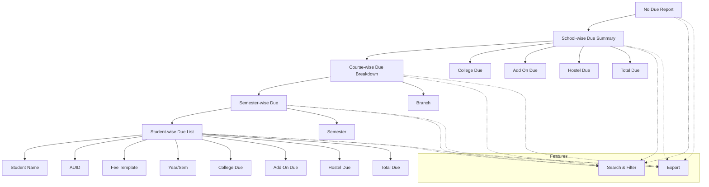

# No Due Report

The **No Due Report** section in Acharya ERP provides a hierarchical view of all types of student dues, grouped by school, course, and semester. Administrators can drill down from a summary of dues at the school level to detailed lists of students with their respective dues for each semester. This enables efficient tracking and management of outstanding amounts across the institution.

---

## Key Features

- **School-wise Due Summary:** View total College Due, Add On Due, Hostel Due, and Total Due for each school.
- **Course-wise Due Breakdown:** Click on a school to see dues grouped by course and branch, with semester-wise details.
- **Semester-wise Student Dues:** Click on a semester due amount to view all students in that semester, along with their individual dues.
- **Search, Filter, and Export:** Use advanced tools to search, filter, and export due data at any level for reporting or reconciliation.

---

## Architecture Diagram

- The report starts with a **School-wise Due Summary** showing all due types.
- Clicking a school drills down to **Course-wise Due Breakdown** (by course and branch).
- Clicking a semester due amount shows the **Student-wise Due List** for that semester.
- At each level, users can search, filter, and export data for further analysis.

---

## Functional Flow

1. **View School-wise Due Summary:**  
   See a summary of all dues (college, add on, hostel, total) for each school.

2. **Drill Down to Course-wise Due:**  
   Click on a school to view dues grouped by course and branch, with semester-wise breakdowns.

3. **Drill Down to Student-wise Due:**  
   Click on a semester due amount to see all students in that semester, with their individual due details.

4. **Search, Filter, and Export:**  
   Use search and filter tools at any level. Export data for reporting or reconciliation.

---

## Field Specifications

### School-wise View

| Field       | Description                          |
| ----------- | ------------------------------------ |
| School Name | Name of the school/institute         |
| College Due | Total college due for the school     |
| Add On Due  | Total add on due for the school      |
| Hostel Due  | Total hostel due for the school      |
| Total Due   | Total outstanding due for the school |

### Course-wise View

| Field      | Description                  |
| ---------- | ---------------------------- |
| Course     | Name of the course           |
| Branch     | Branch or specialization     |
| Sem 1-10   | Due amount for each semester |
| Hostel Due | Hostel due for the course    |
| Total Due  | Total due for the course     |

### Student-wise View

| Field        | Description                           |
| ------------ | ------------------------------------- |
| Student Name | Name of the student                   |
| AUID         | Acharya Unique ID                     |
| Fee Template | Fee template assigned                 |
| Year/Sem     | Current year and semester             |
| College Due  | College due for the student           |
| Add On Due   | Add on due for the student            |
| Hostel Due   | Hostel due for the student            |
| Total Due    | Total outstanding due for the student |
