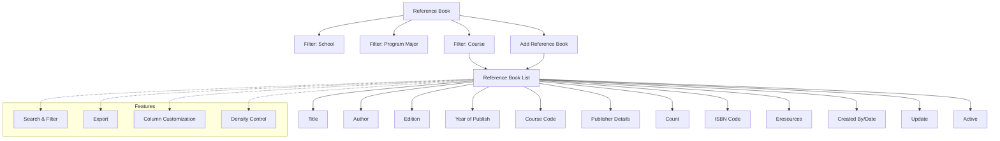

# Reference Book

The **Reference Book** section in Acharya ERP allows administrators and librarians to manage reference book records for each course. Users can view the list of reference books associated with a particular course, filter and search through the records, and add new reference book entries with detailed information.

---

## Key Features

- **View Reference Books:** See all reference books linked to a specific course, including details such as title, author, edition, year of publication, course code, publisher, and count.
- **Add Reference Book:** Add new reference book entries by specifying school, program major, course, title, author, edition, year of publish, publisher details, count, and optional ISBN code.
- **Edit and Update:** Update existing reference book records as needed.
- **Search, Filter, and Export:** Use advanced tools to search, filter, and export reference book data.
- **Column Customization & Density:** Adjust visible columns and table density for better readability.

---

## Architecture Diagram

- The process starts by filtering by school, program major, and course.
- The **Reference Book List** displays all reference books for the selected course, with full details.
- Users can add new reference books or update existing entries.
- Features such as search, filter, export, column customization, and density control are available for efficient management.

---

## Functional Flow

1. **Filter and View Reference Books:**  
   Select school, program major, and course to view the list of reference books for that course.

2. **Add Reference Book:**  
   Click "Create" and fill in the required details (school, program major, course, title, author, edition, year, publisher, count, ISBN code) to add a new reference book entry.

3. **Edit or Update:**  
   Use the update action to modify existing reference book records.

4. **Search, Filter, and Export:**  
   Use search and filter tools to quickly find specific books. Export the list as needed.

---

## Field Specifications

| Field             | Description                                   |
| ----------------- | --------------------------------------------- |
| School            | Name of the school/institute                  |
| Program Major     | Program specialization                        |
| Course            | Course name                                   |
| Title             | Title of the reference book                   |
| Author            | Author(s) of the book                         |
| Edition           | Edition number                                |
| Year of Publish   | Year the book was published                   |
| Course Code       | Code of the associated course                 |
| Publisher Details | Name of the publisher                         |
| Count             | Number of copies available                    |
| ISBN Code         | International Standard Book Number (optional) |
| Eresources        | Availability of electronic resources          |
| Created By        | User who created the entry                    |
| Created Date      | Date of creation                              |
| Update            | Edit reference book details                   |
| Active            | Indicates if the book is active               |

---

This section ensures accurate and organized management of reference book resources, supporting academic and library operations.
