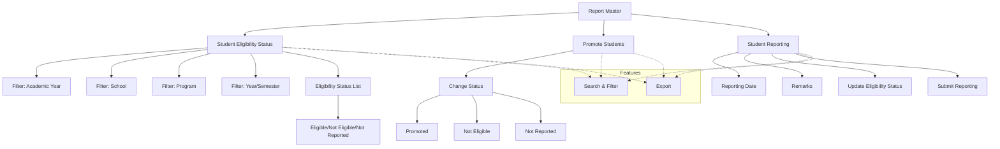

# Report Master

The **Report Master** section in Acharya ERP provides a centralized interface for managing student promotion and reporting processes. It consists of three main sections: viewing student eligibility, promoting students, and recording student reporting on specific dates. This module helps administrators efficiently track academic progress and maintain accurate records for each semester.

---

## Key Features

- **Student Eligibility Status:** View the list of students for a selected semester, program, and school, along with their eligibility status for promotion.
- **Promote Students:** Change the status of students to "Promoted," "Not Eligible," or "Not Reported" based on academic criteria.
- **Student Reporting:** Record the reporting of students on a specific date, add remarks, and update eligibility status in bulk.
- **Search, Filter, and Export:** Use advanced tools to search, filter, and export student data for reporting or analysis.

---

## Architecture Diagram

- **Report Master** contains three main sections: Student Eligibility Status, Promote Students, and Student Reporting.
- **Student Eligibility Status** allows filtering by academic year, school, program, and semester, and displays the eligibility status for each student.
- **Promote Students** enables administrators to update the promotion status of students.
- **Student Reporting** is used to record student reporting on a specific date, with remarks and eligibility updates.
- **Features** such as search, filter, and export are available across all sections for efficient data management.

---

## Functional Flow

1. **View Student Eligibility Status:**

   - Select academic year, school, program, and semester.
   - View the list of students and their eligibility status for promotion.

2. **Promote Students:**

   - Select students and update their status to "Promoted," "Not Eligible," or "Not Reported."
   - Submit changes to update records.

3. **Student Reporting:**

   - Select students and enter the reporting date and remarks.
   - Update eligibility status as needed and submit the report.

4. **Search, Filter, and Export:**
   - Use search and filter tools to refine the student list.
   - Export data for reporting or analysis.

---

## Field Specifications

| Field          | Description                                                         |
| -------------- | ------------------------------------------------------------------- |
| Student Name   | Name of the student                                                 |
| AUID           | Acharya Unique ID                                                   |
| USN            | University Serial Number                                            |
| Year/Sem       | Current year and semester                                           |
| Reporting Date | Date when the student reported                                      |
| Created Date   | Date the record was created                                         |
| Created By     | User who created the record                                         |
| Status         | Eligibility status (Eligible, Not Eligible, Not Reported, Promoted) |
| Remarks        | Additional comments or notes                                        |
