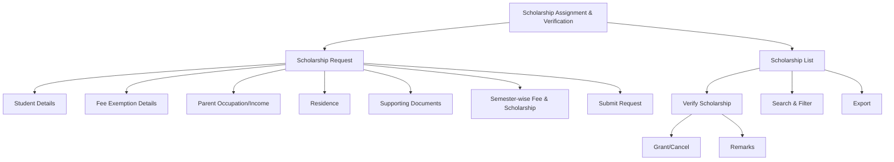

# Scholarship Assignment & Verification

The **Scholarship Assignment & Verification** section in Acharya ERP manages the entire scholarship process for students. It allows students or administrators to request scholarships, feed all relevant details, and provides a workflow for verifying, granting, or cancelling scholarship requests.

---

## Key Features

- **Scholarship Request:** Create new scholarship requests by entering student details, fee exemption reasons, parent occupation/income, residence, and uploading supporting documents.
- **Scholarship List:** View all scholarship requests with details such as application number, student name, AUID, program, requested amount, requested by, date, reason for exemption, and document status.
- **Verification Workflow:** Verify each scholarship request directly from the main table. Approve (grant) or cancel requests based on eligibility and documentation.
- **Semester-wise Fee & Scholarship:** View and verify fixed fees, requested amounts, and verified scholarship amounts for each semester.
- **Remarks & Audit Trail:** Add remarks during verification and track all actions for compliance.
- **Search, Filter, and Export:** Use advanced tools to search, filter, and export scholarship data for reporting or analysis.

---

## Architecture Diagram

- **Scholarship Request**: Enter all required student and scholarship details, then submit the request.
- **Scholarship List**: Displays all requests with options to verify, grant, or cancel.
- **Verification**: Verifiers review requests, check documentation, and update the status (granted/cancelled) with remarks.
- **Features**: Search, filter, and export are available for efficient management and reporting.

---

## Functional Flow

1. **Create Scholarship Request:**

   - Enter AUID to fetch student details.
   - Fill in residence, parent occupation/income, reason for fee exemption, and upload supporting documents.
   - Enter semester-wise fee and requested scholarship amounts.
   - Submit the request.

2. **View & Manage Requests:**

   - Access the list of all scholarship requests.
   - Use search and filter tools to find specific applications.

3. **Verify Scholarship:**

   - Click the verify icon to review a request.
   - Check all details and documents.
   - Enter verified scholarship amounts for each semester.
   - Add remarks and approve (grant) or cancel the request.

4. **Export Data:**
   - Export scholarship data for reporting or compliance.

---

## Field Specifications

| Field                | Description                                       |
| -------------------- | ------------------------------------------------- |
| Application No       | Unique scholarship application number             |
| Student Name         | Name of the student                               |
| AUID                 | Acharya Unique ID                                 |
| Program              | Program enrolled                                  |
| Requested Amount     | Total scholarship amount requested                |
| Requested By         | User who created the request                      |
| Requested Date       | Date of scholarship request                       |
| Reason for Exemption | Reason for fee exemption (e.g., Merit, Waiver)    |
| Parent Occupation    | Occupation of the parent                          |
| Parent Income        | Parent's annual income                            |
| Residence            | Student's residence type (Own/Rented)             |
| Document             | Uploaded supporting document                      |
| Fee Details          | Semester-wise fixed fee and requested scholarship |
| Verified Amount      | Amount verified and granted                       |
| Remarks              | Remarks added during verification                 |
| Status               | Granted, Cancelled, or Pending                    |
