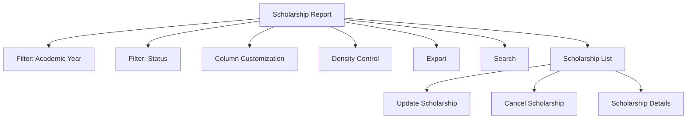

# Scholarship Report

The **Scholarship Report** section in Acharya ERP provides a comprehensive overview of all scholarship requests, including their verification, approval, and cancellation status. Administrators can view, update, or cancel scholarship records, and analyze detailed information for each request. The report supports advanced filtering, column customization, density control, and export for efficient management and reporting.

---

## Key Features

- **Comprehensive Scholarship List:** View all scholarship requests with their current status (requested, verified, approved, cancelled).
- **Update or Cancel Scholarship:** Edit scholarship details or cancel requests directly from the report.
- **Advanced Filtering:** Filter scholarships by academic year, status, or other parameters.
- **Column Customization & Density:** Show/hide columns and adjust table density for better readability.
- **Export:** Export scholarship data for reporting or compliance.
- **Search:** Quickly locate specific requests or students using the search bar.

---

## Architecture Diagram

- The report aggregates all scholarship requests and their statuses.
- Users can filter, search, and customize the view.
- Each record can be updated or cancelled as needed.
- Export and density controls support efficient data handling.

---

## Field Specifications

| Field             | Description                                     |
| ----------------- | ----------------------------------------------- |
| Student Name      | Name of the student                             |
| AUID              | Acharya Unique ID                               |
| Requested By      | User who created the scholarship request        |
| Requested Date    | Date when the scholarship was requested         |
| Requested Amount  | Amount requested by the student                 |
| Requested Remarks | Remarks provided during the request             |
| Verified By       | User who verified the scholarship               |
| Verified Date     | Date of verification                            |
| Verified Amount   | Amount verified for the scholarship             |
| Verified Remarks  | Remarks added during verification               |
| Approved By       | User who approved the scholarship               |
| Approved Date     | Date of approval                                |
| Approved Amount   | Amount approved                                 |
| Approver Remarks  | Remarks added by the approver                   |
| Cancelled By      | User who cancelled the scholarship              |
| Cancelled Date    | Date of cancellation                            |
| Cancelled Remarks | Remarks for cancellation                        |
| Attachment        | Supporting document(s) uploaded                 |
| Print             | Option to print scholarship details/certificate |
| Cancel            | Action to cancel the scholarship                |
| Update            | Action to update scholarship details            |
