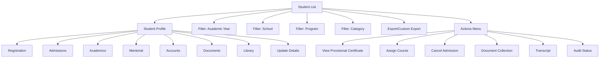

# Student Details

The **Student Details** section in Acharya ERP displays a comprehensive list of all students in the organization, along with their detailed information. Administrators can filter students by academic year, school, program, and category, and perform various actions such as viewing certificates, updating records, and exporting data.

---

## Key Features

- **Student List & Filtering:** View all students and filter by academic year, school, program, and category.
- **Student Actions:** View provisional certificates, manage documents, assign courses, cancel admissions, and more via the action menu.
- **Student Profile:** Click on a student's name to access their full profile, including registration, admissions, academics, mentorial, accounts, documents, and library details.
- **Update Student Information:** Edit and update student details across multiple sections (personal, academic, address, etc.).
- **Export:** Export selected or all student details to a CSV file for reporting or analysis.
- **Custom Export:** Choose specific fields to include in the export using the custom export feature.

---

## Architecture Diagram

- **Student List** is the main view, with filters for academic year, school, program, and category.
- Each student can be selected for actions (certificates, course assignment, etc.) via the **Actions Menu**.
- Clicking a student's name opens their **Student Profile**, which includes sections for registration, admissions, academics, mentorial, accounts, documents, and library.
- **Export** and **Custom Export** allow administrators to download student data as needed.

---

## Functional Flow

1. **Filter Students:**  
   Use the filters to narrow down the student list by academic year, school, program, or category.

2. **View & Manage Student:**

   - Click on a student's name to view and update their complete profile.
   - Use the action menu for quick tasks like viewing certificates, assigning courses, or collecting documents.

3. **Update Student Details:**  
   Edit and update student information in sections such as personal details, additional information, address, program details, and academic background.

4. **Export Data:**  
   Export student details to CSV using the export or custom export options, selecting the fields required.

---

## Field Specifications

| Field            | Description                                   |
| ---------------- | --------------------------------------------- |
| Name             | Student's full name                           |
| AUID             | Acharya Unique ID                             |
| USN              | University Serial Number                      |
| DOA              | Date of Admission                             |
| School/Institute | School or institute name                      |
| Program          | Program enrolled                              |
| Year/Sem         | Current year and semester                     |
| Category         | Student category (e.g., GOV, MGT, INT)        |
| Created By       | User who created the student record           |
| Mentor           | Assigned mentor                               |
| Provisional      | Provisional certificate status                |
| Documents        | Document upload and status                    |
| Action           | Menu for actions (view, assign, cancel, etc.) |
| Edit             | Edit student details                          |
