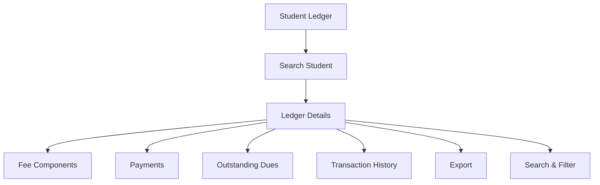

# Student Ledger

The **Student Ledger** section in Acharya ERP provides a detailed view of each student's financial transactions, including all fee components, payments made, and outstanding dues. This section is essential for administrators and accounts staff to monitor and review the financial status of students across semesters.

---

## Key Features

- **Student Search:** Search for a student using their AUID to retrieve ledger information.
- **View Ledger Details:** Review comprehensive fee and payment information for each semester, including fixed fees, add-on fees, paid amounts, and outstanding dues.
- **Transaction History:** Access a chronological record of all financial transactions for the student.
- **Search & Filter:** Use search and filter tools to quickly locate specific students or transactions.
- **Export:** Export ledger data for reporting or reconciliation.

---

## Architecture Diagram

- The process starts by searching for a student.
- The system displays the student's ledger details, including all fee components, payments, and outstanding dues.
- Users can view the transaction history, search/filter records, and export data as needed.

---

## Functional Flow

1. **Search Student:**

   - Enter the student's AUID and submit to retrieve their ledger information.

2. **View Ledger Details:**

   - Review the student's fee, payment, and due details for each semester.
   - Access the full transaction history.

3. **Search, Filter, and Export:**
   - Use search and filter tools to find specific records.
   - Export ledger data for reporting or analysis.

---

## Field Specifications

| Field            | Description                                      |
| ---------------- | ------------------------------------------------ |
| AUID             | Acharya Unique ID of the student                 |
| Student Name     | Name of the student                              |
| Program          | Program enrolled                                 |
| Year/Sem         | Current year and semester                        |
| Fee Template     | Fee template assigned                            |
| Nationality      | Student's nationality                            |
| Reporting Status | Reporting status of the student                  |
| Mobile No.       | Student's contact number                         |
| Fee Components   | Breakdown of all fee types (fixed, add-on, etc.) |
| Paid             | Amount paid by the student                       |
| Due              | Outstanding due amount                           |
| Transaction Date | Date of each transaction                         |
