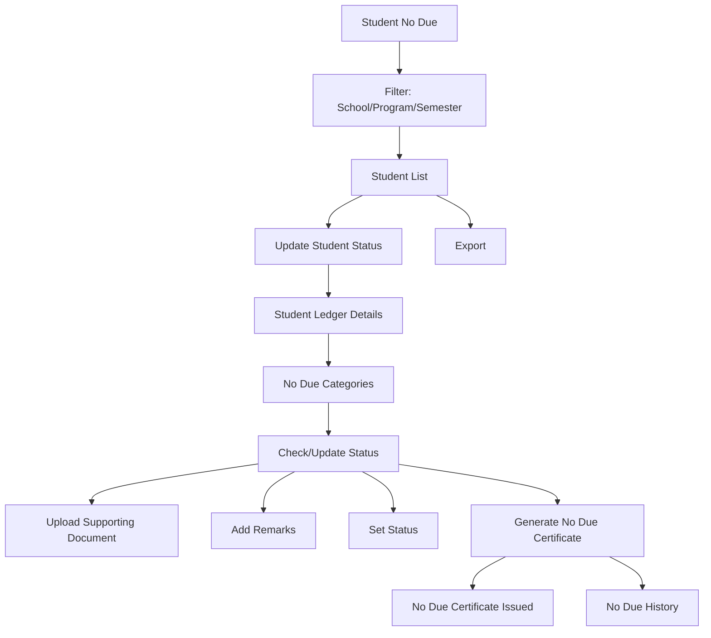

# Student No Due

The **Student No Due** section in Acharya ERP is used to generate No Due certificates for students. Administrators can filter students by school, program, and semester to view a list of eligible students. For each student, the system provides access to their ledger details, allowing administrators to verify dues and generate the No Due certificate if all requirements are met.

---

## Key Features

- **Filter Students:** Retrieve a list of students based on selected school, program specialization, and semester.
- **View Student Ledger:** Access detailed ledger information for each student, including fee components, payments, and outstanding dues.
- **No Due Categories:** Check and update no due status for categories such as Library, Accounts, Mentor, and Sports.
- **Generate No Due Certificate:** Issue a No Due certificate for students who have cleared all dues, with options to upload supporting documents and add remarks.
- **Status Update:** Set the student's status (e.g., Passed out, NFTC, Inactive) as part of the certificate generation process.
- **History & Export:** View the history of issued certificates and export data for reporting.

---

## Architecture Diagram

### Architecture Explanation

- The process starts by filtering students by school, program, and semester.
- The resulting **Student List** allows administrators to update student status.
- Clicking "Update Student Status" opens the **Student Ledger Details** and **No Due Categories** (Library, Accounts, Mentor, Sports).
- Administrators can check/update status, upload documents, add remarks, and set the student's status.
- If all dues are cleared, the **No Due Certificate** is generated and recorded in the history.
- Export functionality is available for reporting.

---

## Functional Flow

1. **Filter Students:**  
   Select school, program specialization, and semester to retrieve the student list.

2. **Update Student Status:**  
   Click the update icon for a student to view their ledger details and no due categories.

3. **Verify and Update:**  
   Check each no due category, upload supporting documents (PDF), select the status, and add comments.

4. **Generate Certificate:**  
   If all dues are cleared, generate and issue the No Due certificate. The certificate is recorded in the history.

5. **Export Data:**  
   Export the list of students and certificate history as needed.

---

## Field Specifications

| Field               | Description                               |
| ------------------- | ----------------------------------------- |
| School              | Name of the school/institute              |
| Program             | Program specialization                    |
| Year/Semester       | Current year and semester                 |
| Name                | Student's full name                       |
| AUID                | Acharya Unique ID                         |
| USN                 | University Serial Number                  |
| Student Status      | Current status (Eligible, Promoted, etc.) |
| No Due Categories   | Library, Accounts, Mentor, Sports         |
| Date                | Date of certificate issuance              |
| Status              | Passed out, NFTC, Inactive, etc.          |
| Comments            | Additional remarks                        |
| Supporting Document | PDF upload (No Due proof, less than 2MB)  |
| No Due Certificate  | Generated certificate (view/print)        |

---

This section ensures that No Due certificates are only issued to students who have cleared all required dues, supporting transparent and compliant administrative processes.
