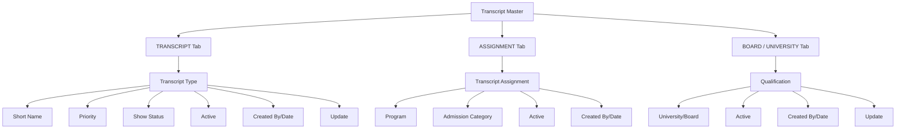

# Transcript Master

The **Transcript Master** module in Acharya ERP is a centralized configuration hub for managing all student-related documents, certificates, and academic transcripts. It enables institutions to define, assign, and map various transcript types to programs, admission categories, and educational boards/universities, ensuring streamlined document management and compliance.

---

## Main Sections

### 1. TRANSCRIPT

This serves as the master registry for all available transcript types (certificates/documents) within the system.

**Key Features:**

- Add, edit, and manage transcript types (e.g., Provisional Degree Certificate, Character Certificate, Income Certificate).
- Set display priority and visibility (Show Status) for each transcript.
- Track creation and update history.
- Activate or deactivate transcript types as needed.

**Fields:**
| Field | Description |
|--------------|---------------------------------------------------------|
| Transcript | Name of the certificate/document |
| Short Name | Internal/official short label |
| Priority | Order of display or urgency |
| Show Status | Visibility to students/staff |
| Created By | User who created the entry |
| Created Date | Date of creation |
| Update | Edit transcript entry |
| Active | Whether the transcript is currently active |

---

### 2. ASSIGNMENT

This maps transcript types to specific academic programs and admission categories, allowing for program-specific document requirements.

**Key Features:**

- Assign required transcripts to one or more programs and admission categories.
- Customize document requirements for each department or course.
- Track assignment creation and status.
- Activate or deactivate assignments as needed.

**Fields:**
| Field | Description |
|-------------------|-----------------------------------------------------|
| Transcript | Name of the document being assigned |
| Program | Academic program code (e.g., MSN, MPT, COMRC) |
| Admission Category| Type/category of admission (e.g., Management Quota) |
| Created By | User who created the assignment |
| Created Date | Date of assignment |
| Active | Whether the assignment is currently valid |

---

### 3. BOARD / UNIVERSITY

This defines and maps academic qualifications to recognized boards or universities.

**Key Features:**

- Add and manage qualifications (e.g., SSLC, PUC, UG, PG) and link them to specific boards/universities.
- Edit and activate/deactivate qualification-board mappings.
- Track creation and update history.

**Fields:**
| Field | Description |
|---------------|-----------------------------------------------|
| Qualification | Name of the academic level (e.g., SSLC, UG) |
| University | Linked board or university (e.g., Karnataka State Board) |
| Created By | User who created the entry |
| Created Date | Date of creation |
| Update | Edit qualification-board mapping |
| Active | Whether the mapping is currently active |

---

## Architecture Diagram

- **Transcript Master** is divided into three main tabs: TRANSCRIPT, ASSIGNMENT, and BOARD/UNIVERSITY.
- The **TRANSCRIPT** manages the master list of all transcript types and their properties.
- The **ASSIGNMENT** maps transcripts to specific programs and admission categories, customizing requirements.
- The **BOARD/UNIVERSITY** links qualifications to recognized boards/universities for validation and compliance.
- Each tab supports creation, editing, activation, and audit tracking for robust document management.
