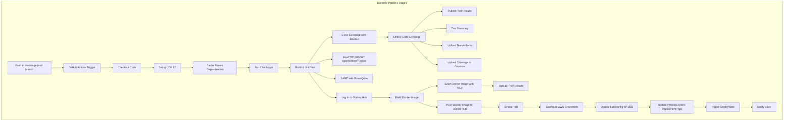

## Backend Pipeline Stages

Each pipeline consists of a single job (`build-and-deploy-dev`) running on an `ubuntu-latest` runner. Stages are executed sequentially with environment-specific configurations for the Acharya ERP frontend, a Spring-boot application.



### 1. **Checkout Code**
   - **Purpose**: Retrieve the source code from the GitHub repository.
   - **What It Does**: Uses `actions/checkout@v4` to clone the repository (`dev` branch).
   - **Requirements**: `contents: read` permission.
   - **Why It’s Needed**: Makes the codebase available for building and testing.
   #### YAML Configuration
   ```yaml
   - name: Checkout code
     uses: actions/checkout@v4
   ```

### 2. **Set up JDK 17**
   - **Purpose**: Configure the Java runtime environment.
   - **What It Does**: Uses `actions/setup-java@v4` to install JDK 17 (Temurin distribution).
   - **Requirements**: A Java-based project with `pom.xml`, `actions: read` permission.
   - **Why It’s Needed**: Provides the environment for Maven builds.
   #### YAML Configuration
   ```yaml
   - name: Set up JDK 17
     uses: actions/setup-java@v4
     with:
       java-version: '17'
       distribution: 'temurin'
   ```

### 3. **Cache Maven Dependencies**
   - **Purpose**: Speed up builds by caching dependencies.
   - **What It Does**: Uses `actions/cache@v4` to cache `~/.m2` based on `pom.xml` hash.
   - **Requirements**: Maven project, `actions: read` permission.
   - **Why It’s Needed**: Reduces build time by avoiding redundant dependency downloads.
   #### YAML Configuration
   ```yaml
   - name: Cache Maven dependencies
     uses: actions/cache@v4
     with:
       path: ~/.m2
       key: ${{ runner.os }}-maven-${{ hashFiles('**/pom.xml') }}
       restore-keys: ${{ runner.os }}-maven-
   ```

### 4. **Run Checkstyle**
   - **Purpose**: Enforce coding standards.
   - **What It Does**: Runs `mvn checkstyle:check` to validate code style, fails on violations.
   - **Requirements**: Checkstyle plugin in `pom.xml`.
   - **Why It’s Needed**: Ensures consistent code quality.
   #### YAML Configuration
   ```yaml
   - name: Run Checkstyle
     run: mvn checkstyle:check
     continue-on-error: false
   ```

### 5. **Build and Unit Test**
   - **Purpose**: Compile and test the application.
   - **What It Does**: Runs `mvn clean package -B` to compile and run unit tests, generating reports in `target/surefire-reports`.
   - **Requirements**: Valid `pom.xml` with Surefire plugin, test classes.
   - **Why It’s Needed**: Ensures code functionality and correctness.
   #### YAML Configuration
   ```yaml
   - name: Build and Unit Test
     run: mvn clean package -B
   ```

### 6. **Code Coverage with JaCoCo**
   - **Purpose**: Measure test coverage.
   - **What It Does**: Runs `mvn jacoco:report` to generate `jacoco.xml` in `target/site/jacoco`.
   - **Requirements**: JaCoCo plugin in `pom.xml`, unit tests.
   - **Why It’s Needed**: Assesses test quality and coverage.
   #### YAML Configuration
   ```yaml
   - name: Code Coverage with JaCoCo
     run: mvn jacoco:report
   ```

### 7. **Check Code Coverage**
   - **Purpose**: Validate coverage threshold.
   - **What It Does**: Parses `jacoco.xml` using `xmlstarlet` to check if line coverage is ≥80%, fails if below threshold.
   - **Requirements**: `jacoco.xml`, `xmlstarlet` installed.
   - **Why It’s Needed**: Enforces minimum test coverage standards.
   #### YAML Configuration
   ```yaml
   - name: Check Code Coverage
     run: |
       if [ ! -f ./target/site/jacoco/jacoco.xml ]; then
         echo "❌ Coverage report file not found"
         exit 1
       fi
       COVERAGE=$(xmlstarlet sel -t -v "//counter[@type='LINE']/attribute::covered" target/site/jacoco/jacoco.xml | awk '{covered+=$1} END {print covered}' && xmlstarlet sel -t -v "//counter[@type='LINE']/attribute::missed" target/site/jacoco/jacoco.xml | awk '{missed+=$1} END {print missed}' | awk '{print (covered/(covered+missed))*100}')
       if (( $(echo "$COVERAGE < 80" | bc -l) )); then
         echo "❌ Code coverage is $COVERAGE%, below the 80% threshold"
         exit 1
       else
         echo "✅ Code coverage is $COVERAGE%, meets the 80% threshold"
       fi
   ```

### 8. **Publish Test Results**
   - **Purpose**: Display test results in GitHub.
   - **What It Does**: Uses `dorny/test-reporter@v1` to publish JUnit reports from `target/surefire-reports/*.xml`, continues on failure.
   - **Requirements**: JUnit reports, `checks: write` permission.
   - **Why It’s Needed**: Provides quick test feedback in GitHub UI.
   #### YAML Configuration
   ```yaml
   - name: Publish Test Results
     uses: dorny/test-reporter@v1
     if: always()
     with:
       name: Maven Tests (Dev)
       path: target/surefire-reports/*.xml
       reporter: java-junit
       fail-on-error: false
     continue-on-error: true
   ```

### 9. **Test Summary**
   - **Purpose**: Summarize test results.
   - **What It Does**: Uses `mikepenz/action-junit-report@v3` to parse `TEST-*.xml` files and write summary to `$GITHUB_STEP_SUMMARY`.
   - **Requirements**: JUnit reports, `checks: write` permission, `GITHUB_TOKEN`.
   - **Why It’s Needed**: Provides a concise test result summary.
   #### YAML Configuration
   ```yaml
   - name: Test Summary
     uses: mikepenz/action-junit-report@v3
     if: always()
     with:
       report_paths: 'target/surefire-reports/*.xml'
       summary: true
       github_token: ${{ secrets.GITHUB_TOKEN }}
   ```

### 10. **Upload Test Results as Artifacts**
   - **Purpose**: Store test and coverage reports.
   - **What It Does**: Uses `actions/upload-artifact@v4` to upload `surefire-reports/*.xml` and `jacoco.xml` with 30-day retention.
   - **Requirements**: Test reports, `actions: write` permission.
   - **Why It’s Needed**: Enables post-build analysis of test results.
   #### YAML Configuration
   ```yaml
   - name: Upload Test Results as Artifacts
     uses: actions/upload-artifact@v4
     if: always()
     with:
       name: test-results-dev
       path: |
         target/surefire-reports/*.xml
         target/site/jacoco/jacoco.xml
       retention-days: 30
   ```

### 11. **Upload Coverage to Codecov**
   - **Purpose**: Track coverage metrics.
   - **What It Does**: Uses `codecov/codecov-action@v4` to upload `jacoco.xml` to Codecov with `unittests` flag.
   - **Requirements**: Codecov account, `jacoco.xml`, internet access.
   - **Why It’s Needed**: Monitors coverage trends over time.
   #### YAML Configuration
   ```yaml
   - name: Upload Coverage to Codecov
     uses: codecov/codecov-action@v4
     if: always()
     with:
       file: ./target/site/jacoco/jacoco.xml
       flags: unittests
       name: codecov-umbrella-dev
   ```

### 12. **SCA with OWASP Dependency-Check**
   - **Purpose**: Identify dependency vulnerabilities.
   - **What It Does**: Runs `mvn org.owasp:dependency-check-maven:check`, generates reports in `target`.
   - **Requirements**: OWASP plugin in `pom.xml`, `NVD_API_KEY` secret.
   - **Why It’s Needed**: Enhances security by detecting vulnerable dependencies.
   #### YAML Configuration
   ```yaml
   - name: SCA with OWASP Dependency-Check
     run: mvn org.owasp:dependency-check-maven:check
     env:
       NVD_API_KEY: ${{ secrets.NVD_API_KEY }}
   ```

### 13. **SAST with SonarQube**
   - **Purpose**: Detect code quality and security issues.
   - **What It Does**: Uses `sonarsource/sonarqube-scan-action@v2` to run SonarQube scan, integrating JaCoCo (`jacoco.xml`) and Dependency-Check reports (`dependency-check-report.json/html`).
   - **Requirements**: SonarQube server, `SONAR_TOKEN`, `SONAR_HOST_URL`, reports.
   - **Why It’s Needed**: Improves code quality and security.
   #### YAML Configuration
   ```yaml
   - name: SAST with SonarQube
     uses: sonarsource/sonarqube-scan-action@v2
     env:
       SONAR_TOKEN: ${{ secrets.SONAR_TOKEN }}
       SONAR_HOST_URL: ${{ secrets.SONAR_HOST_URL }}
     with:
       args: >
         -Dsonar.projectKey=backend-dev
         -Dsonar.organization=acharya
         -Dsonar.coverage.jacoco.xmlReportPaths=target/site/jacoco/jacoco.xml
         -Dsonar.dependencyCheck.jsonReportPath=target/dependency-check-report.json
         -Dsonar.dependencyCheck.htmlReportPath=target/dependency-check-report.html
         -Dsonar.projectName=acharyaerp-backend-dev
   ```

### 14. **Log in to Docker Hub**
   - **Purpose**: Authenticate with Docker Hub.
   - **What It Does**: Uses `docker/login-action@v3` with `DOCKER_USERNAME_DEV` and `DOCKER_PASSWORD_DEV` credentials.
   - **Requirements**: Docker Hub account, credentials, `actions: read` permission.
   - **Why It’s Needed**: Enables pushing images to Docker Hub.
   #### YAML Configuration
   ```yaml
   - name: Log in to Docker Hub
     uses: docker/login-action@v3
     with:
       username: ${{ secrets.DOCKER_USERNAME_DEV }}
       password: ${{ secrets.DOCKER_PASSWORD_DEV }}
   ```

### 15. **Build Docker Image**
   - **Purpose**: Create a Docker image.
   - **What It Does**: Builds image tagged as `backend:dev-<sha>` and `backend:dev-latest` using `docker build` and `docker tag`.
   - **Requirements**: `Dockerfile`, build artifact (JAR).
   - **Why It’s Needed**: Packages application for deployment.
   #### YAML Configuration
   ```yaml
   - name: Build Docker Image
     run: |
       docker build -t ${{ secrets.DOCKER_USERNAME_DEV }}/backend:dev-${{ github.sha }} .
       docker tag ${{ secrets.DOCKER_USERNAME_DEV }}/backend:dev-${{ github.sha }} ${{ secrets.DOCKER_USERNAME_DEV }}/backend:dev-latest
   ```

### 16. **Scan Docker Image with Trivy**
   - **Purpose**: Scan image for vulnerabilities.
   - **What It Does**: Uses `aquasecurity/trivy-action@master` to scan the image, outputs `trivy-results.sarif`, fails on `CRITICAL` or `HIGH` severity vulnerabilities.
   - **Requirements**: Built Docker image, Trivy action.
   - **Why It’s Needed**: Ensures container security.
   #### YAML Configuration
   ```yaml
   - name: Scan Docker Image with Trivy
     uses: aquasecurity/trivy-action@master
     with:
       image-ref: ${{ secrets.DOCKER_USERNAME_DEV }}/backend:dev-${{ github.sha }}
       format: 'sarif'
       output: 'trivy-results.sarif'
       exit-code: '1'
       ignore-unfixed: true
       severity: 'CRITICAL,HIGH'
   ```

### 17. **Upload Trivy Scan Results**
   - **Purpose**: Display vulnerabilities in GitHub.
   - **What It Does**: Uses `github/codeql-action/upload-sarif@v3` to upload `trivy-results.sarif`, skipped for Dependabot PRs.
   - **Requirements**: SARIF file, `security-events: write` permission.
   - **Why It’s Needed**: Provides visibility into container vulnerabilities.
   #### YAML Configuration
   ```yaml
   - name: Upload Trivy scan results
     uses: github/codeql-action/upload-sarif@v3
     if: always() && github.actor != 'dependabot[bot]'
     with:
       sarif_file: 'trivy-results.sarif'
   ```

### 18. **Push Docker Image to Docker Hub**
   - **Purpose**: Publish image to Docker Hub.
   - **What It Does**: Pushes `backend:dev-<sha>` and `backend:dev-latest` to the dev repository.
   - **Requirements**: Docker build, login, credentials.
   - **Why It’s Needed**: Makes the image available for deployment.
   #### YAML Configuration
   ```yaml
   - name: Push Docker Image to Docker Hub
     run: |
       docker push ${{ secrets.DOCKER_USERNAME_DEV }}/backend:dev-${{ github.sha }}
       docker push ${{ secrets.DOCKER_USERNAME_DEV }}/backend:dev-latest
   ```

### 19. **Smoke Test**
   - **Purpose**: Verify application functionality.
   - **What It Does**:
     - Runs Docker image (`backend:dev-<sha>`) with `SPRING_PROFILES_ACTIVE=dev`, `MANAGEMENT_ENDPOINTS_WEB_EXPOSURE_INCLUDE=health,info`, and `SERVER_PORT=8080`.
     - Checks health endpoint (`/actuator/health` or `/health`) for `UP` status and HTTP 200 within 30 seconds.
     - Fails if health check or container fails, logs container output on failure.
   - **Requirements**: Docker image, health endpoint, Docker.
   - **Why It’s Needed**: Ensures the application is deployable and functional.
   #### YAML Configuration
   ```yaml
   - name: Smoke Test
     run: |
       echo "Starting smoke test (Dev)..."
       docker stop smokerun-dev 2>/dev/null || true
       docker rm smokerun-dev 2>/dev/null || true
       docker run -d --name smokerun-dev -p 8080:8080 \
         -e SPRING_PROFILES_ACTIVE=dev \
         -e MANAGEMENT_ENDPOINTS_WEB_EXPOSURE_INCLUDE=health,info \
         -e SERVER_PORT=8080 \
         ${{ secrets.DOCKER_USERNAME_DEV }}/backend:dev-${{ github.sha }}
       echo "Waiting for application to start..."
       for i in {1..6}; do
         if curl -f -s http://localhost:8080/actuator/health > /dev/null 2>&1; then
           echo "✅ Application started successfully!"
           break
         elif curl -f -s http://localhost:8080/health > /dev/null 2>&1; then
           echo "✅ Application started successfully!"
           break
         fi
         if [ $i -eq 6 ]; then
           echo "❌ Application failed to start within 30 seconds"
           docker logs smokerun-dev
           docker rm -f smokerun-dev
           exit 1
         fi
         echo "Waiting... (attempt $i/6)"
         sleep 5
       done
       HEALTH_RESPONSE=$(curl -s http://localhost:8080/actuator/health 2>/dev/null || curl -s http://localhost:8080/health 2>/dev/null)
       if [[ "$HEALTH_RESPONSE" == *"UP"* ]]; then
         echo "✅ Health check passed: $HEALTH_RESPONSE"
       else
         echo "❌ Health check failed: $HEALTH_RESPONSE"
         docker logs smokerun-dev
         docker rm -f smokerun-dev
         exit 1
       fi
       HTTP_STATUS=$(curl -s -o /dev/null -w "%{http_code}" http://localhost:8080/actuator/health 2>/dev/null || curl -s -o /dev/null -w "%{http_code}" http://localhost:8080/health 2>/dev/null)
       if [ "$HTTP_STATUS" -eq 200 ]; then
         echo "✅ HTTP status check passed (200 OK)"
       else
         echo "❌ HTTP status check failed (returned $HTTP_STATUS)"
         docker rm -f smokerun-dev
         exit 1
       fi
       docker rm -f smokerun-dev
       echo "✅ Smoke test completed successfully!"
   ```

### 20. **Configure AWS Credentials**
   - **Purpose**: Authenticate with AWS for EKS.
   - **What It Does**: Uses `aws-actions/configure-aws-credentials@v4` with `AWS_ACCESS_KEY_ID_DEV`, `AWS_SECRET_ACCESS_KEY_DEV`, and `AWS_REGION_DEV`.
   - **Requirements**: AWS credentials, `actions: read` permission.
   - **Why It’s Needed**: Enables access to the EKS cluster.
   #### YAML Configuration
   ```yaml
   - name: Configure AWS Credentials
     uses: aws-actions/configure-aws-credentials@v4
     with:
       aws-access-key-id: ${{ secrets.AWS_ACCESS_KEY_ID_DEV }}
       aws-secret-access-key: ${{ secrets.AWS_SECRET_ACCESS_KEY_DEV }}
       aws-region: ${{ secrets.AWS_REGION_DEV }}
   ```

### 21. **Update kubeconfig for EKS**
   - **Purpose**: Configure EKS cluster access.
   - **What It Does**: Runs `aws eks update-kubeconfig` for the `acharyaerp-dev-cluster` in the specified region.
   - **Requirements**: AWS CLI, credentials, cluster name.
   - **Why It’s Needed**: Enables deployment to the EKS cluster.
   #### YAML Configuration
   ```yaml
   - name: Update kubeconfig for EKS
     run: aws eks update-kubeconfig --region ${{ secrets.AWS_REGION_DEV }} --name acharyaerp-dev-cluster
   ```

### 22. **Update versions.json in deployment-repo**
   - **Purpose**: Update deployment repository with image tag.
   - **What It Does**: Clones `acharyaerp/deployment-repo`, updates `versions.json` with `dev-<sha>` using `jq`, commits, and pushes using `DEPLOYMENT_TOKEN`.
   - **Requirements**: Deployment repo, `DEPLOYMENT_TOKEN`, Git, `jq`.
   - **Why It’s Needed**: Tracks the deployed image version.
   #### YAML Configuration
   ```yaml
   - name: Update versions.json in deployment-repo
     run: |
       git clone https://x-access-token:${{ secrets.DEPLOYMENT_TOKEN }}@github.com/acharyaerp/deployment-repo.git
       cd deployment-repo
       jq '.backend = "dev-${{ github.sha }}"' versions.json > tmp.json && mv tmp.json versions.json
       git add versions.json
       git commit -m "Update backend tag to dev-${{ github.sha }}"
       git push
   ```

### 23. **Trigger Deployment**
   - **Purpose**: Initiate deployment.
   - **What It Does**: Uses `peter-evans/repository-dispatch@v2` to send a `deploy-dev` event to `acharyaerp/deployment-repo`.
   - **Requirements**: `DEPLOYMENT_TOKEN`, `actions: read` permission.
   - **Why It’s Needed**: Triggers the deployment workflow in the deployment repository.
   #### YAML Configuration
   ```yaml
   - name: Trigger deployment
     uses: peter-evans/repository-dispatch@v2
     with:
       token: ${{ secrets.DEPLOYMENT_TOKEN }}
       repository: acharyaerp/deployment-repo
       event-type: deploy-dev
   ```

### 24. **Notify Slack**
   - **Purpose**: Notify team of pipeline status.
   - **What It Does**: Uses `slackapi/slack-github-action@v1` to send a message to the `dev-notifications` Slack channel with pipeline status, commit SHA, and run URL.
   - **Requirements**: `SLACK_BOT_TOKEN`, internet access.
   - **Why It’s Needed**: Keeps the team informed of pipeline outcomes.
   #### YAML Configuration
   ```yaml
   - name: Notify Slack
     if: always()
     uses: slackapi/slack-github-action@v1
     with:
       slack-bot-token: ${{ secrets.SLACK_BOT_TOKEN }}
       channel-id: 'dev-notifications'
       text: |
         *Acharya ERP Backend (Dev) Pipeline*
         Status: ${{ job.status }}
         Commit: ${{ github.sha }}
         Run: ${{ github.server_url }}/${{ github.repository }}/actions/runs/${{ github.run_id }}
   ```

---

### YAML Workflow (Dev) 

`.github/workflows/backend-dev.yml`

```yaml
name: Acharya ERP Backend CI/CD (Dev)

on:
  push:
    branches:
      - dev

permissions:
  contents: read
  actions: read
  checks: write
  pull-requests: write
  security-events: write
  statuses: write

jobs:
  build-and-deploy-dev:
    runs-on: ubuntu-latest
    steps:
      - name: Checkout code
        uses: actions/checkout@v4

      - name: Set up JDK 17
        uses: actions/setup-java@v4
        with:
          java-version: '17'
          distribution: 'temurin'

      - name: Cache Maven dependencies
        uses: actions/cache@v4
        with:
          path: ~/.m2
          key: ${{ runner.os }}-maven-${{ hashFiles('**/pom.xml') }}
          restore-keys: ${{ runner.os }}-maven-

      - name: Run Checkstyle
        run: mvn checkstyle:check
        continue-on-error: false

      - name: Build and Unit Test
        run: mvn clean package -B

      - name: Code Coverage with JaCoCo
        run: mvn jacoco:report

      - name: Check Code Coverage
        run: |
          if [ ! -f ./target/site/jacoco/jacoco.xml ]; then
            echo "❌ Coverage report file not found"
            exit 1
          fi
          COVERAGE=$(xmlstarlet sel -t -v "//counter[@type='LINE']/attribute::covered" target/site/jacoco/jacoco.xml | awk '{covered+=$1} END {print covered}' && xmlstarlet sel -t -v "//counter[@type='LINE']/attribute::missed" target/site/jacoco/jacoco.xml | awk '{missed+=$1} END {print missed}' | awk '{print (covered/(covered+missed))*100}')
          if (( $(echo "$COVERAGE < 80" | bc -l) )); then
            echo "❌ Code coverage is $COVERAGE%, below the 80% threshold"
            exit 1
          else
            echo "✅ Code coverage is $COVERAGE%, meets the 80% threshold"
          fi

      - name: Publish Test Results
        uses: dorny/test-reporter@v1
        if: always()
        with:
          name: Maven Tests (Dev)
          path: target/surefire-reports/*.xml
          reporter: java-junit
          fail-on-error: false
        continue-on-error: true

      - name: Test Summary
        uses: mikepenz/action-junit-report@v3
        if: always()
        with:
          report_paths: 'target/surefire-reports/*.xml'
          summary: true
          github_token: ${{ secrets.GITHUB_TOKEN }}

      - name: Upload Test Results as Artifacts
        uses: actions/upload-artifact@v4
        if: always()
        with:
          name: test-results-dev
          path: |
            target/surefire-reports/*.xml
            target/site/jacoco/jacoco.xml
          retention-days: 30

      - name: Upload Coverage to Codecov
        uses: codecov/codecov-action@v4
        if: always()
        with:
          file: ./target/site/jacoco/jacoco.xml
          flags: unittests
          name: codecov-umbrella-dev

      - name: SCA with OWASP Dependency-Check
        run: mvn org.owasp:dependency-check-maven:check
        env:
          NVD_API_KEY: ${{ secrets.NVD_API_KEY }}

      - name: SAST with SonarQube
        uses: sonarsource/sonarqube-scan-action@v2
        env:
          SONAR_TOKEN: ${{ secrets.SONAR_TOKEN }}
          SONAR_HOST_URL: ${{ secrets.SONAR_HOST_URL }}
        with:
          args: >
            -Dsonar.projectKey=backend-dev
            -Dsonar.organization=acharya
            -Dsonar.coverage.jacoco.xmlReportPaths=target/site/jacoco/jacoco.xml
            -Dsonar.dependencyCheck.jsonReportPath=target/dependency-check-report.json
            -Dsonar.dependencyCheck.htmlReportPath=target/dependency-check-report.html
            -Dsonar.projectName=acharyaerp-backend-dev

      - name: Log in to Docker Hub
        uses: docker/login-action@v3
        with:
          username: ${{ secrets.DOCKER_USERNAME_DEV }}
          password: ${{ secrets.DOCKER_PASSWORD_DEV }}

      - name: Build Docker Image
        run: |
          docker build -t ${{ secrets.DOCKER_USERNAME_DEV }}/backend:dev-${{ github.sha }} .
          docker tag ${{ secrets.DOCKER_USERNAME_DEV }}/backend:dev-${{ github.sha }} ${{ secrets.DOCKER_USERNAME_DEV }}/backend:dev-latest

      - name: Scan Docker Image with Trivy
        uses: aquasecurity/trivy-action@master
        with:
          image-ref: ${{ secrets.DOCKER_USERNAME_DEV }}/backend:dev-${{ github.sha }}
          format: 'sarif'
          output: 'trivy-results.sarif'
          exit-code: '1'
          ignore-unfixed: true
          severity: 'CRITICAL,HIGH'

      - name: Upload Trivy scan results
        uses: github/codeql-action/upload-sarif@v3
        if: always() && github.actor != 'dependabot[bot]'
        with:
          sarif_file: 'trivy-results.sarif'

      - name: Push Docker Image to Docker Hub
        run: |
          docker push ${{ secrets.DOCKER_USERNAME_DEV }}/backend:dev-${{ github.sha }}
          docker push ${{ secrets.DOCKER_USERNAME_DEV }}/backend:dev-latest

      - name: Smoke Test
        run: |
          echo "Starting smoke test (Dev)..."
          docker stop smokerun-dev 2>/dev/null || true
          docker rm smokerun-dev 2>/dev/null || true
          docker run -d --name smokerun-dev -p 8080:8080 \
            -e SPRING_PROFILES_ACTIVE=dev \
            -e MANAGEMENT_ENDPOINTS_WEB_EXPOSURE_INCLUDE=health,info \
            -e SERVER_PORT=8080 \
            ${{ secrets.DOCKER_USERNAME_DEV }}/backend:dev-${{ github.sha }}
          echo "Waiting for application to start..."
          for i in {1..6}; do
            if curl -f -s http://localhost:8080/actuator/health > /dev/null 2>&1; then
              echo "✅ Application started successfully!"
              break
            elif curl -f -s http://localhost:8080/health > /dev/null 2>&1; then
              echo "✅ Application started successfully!"
              break
            fi
            if [ $i -eq 6 ]; then
              echo "❌ Application failed to start within 30 seconds"
              docker logs smokerun-dev
              docker rm -f smokerun-dev
              exit 1
            fi
            echo "Waiting... (attempt $i/6)"
            sleep 5
          done
          HEALTH_RESPONSE=$(curl -s http://localhost:8080/actuator/health 2>/dev/null || curl -s http://localhost:8080/health 2>/dev/null)
          if [[ "$HEALTH_RESPONSE" == *"UP"* ]]; then
            echo "✅ Health check passed: $HEALTH_RESPONSE"
          else
            echo "❌ Health check failed: $HEALTH_RESPONSE"
            docker logs smokerun-dev
            docker rm -f smokerun-dev
            exit 1
          fi
          HTTP_STATUS=$(curl -s -o /dev/null -w "%{http_code}" http://localhost:8080/actuator/health 2>/dev/null || curl -s -o /dev/null -w "%{http_code}" http://localhost:8080/health 2>/dev/null)
          if [ "$HTTP_STATUS" -eq 200 ]; then
            echo "✅ HTTP status check passed (200 OK)"
          else
            echo "❌ HTTP status check failed (returned $HTTP_STATUS)"
            docker rm -f smokerun-dev
            exit 1
          fi
          docker rm -f smokerun-dev
          echo "✅ Smoke test completed successfully!"

      - name: Configure AWS Credentials
        uses: aws-actions/configure-aws-credentials@v4
        with:
          aws-access-key-id: ${{ secrets.AWS_ACCESS_KEY_ID_DEV }}
          aws-secret-access-key: ${{ secrets.AWS_SECRET_ACCESS_KEY_DEV }}
          aws-region: ${{ secrets.AWS_REGION_DEV }}

      - name: Update kubeconfig for EKS
        run: aws eks update-kubeconfig --region ${{ secrets.AWS_REGION_DEV }} --name acharyaerp-dev-cluster

      - name: Update versions.json in deployment-repo
        run: |
          git clone https://x-access-token:${{ secrets.DEPLOYMENT_TOKEN }}@github.com/acharyaerp/deployment-repo.git
          cd deployment-repo
          jq '.backend = "dev-${{ github.sha }}"' versions.json > tmp.json && mv tmp.json versions.json
          git add versions.json
          git commit -m "Update backend tag to dev-${{ github.sha }}"
          git push

      - name: Trigger deployment
        uses: peter-evans/repository-dispatch@v2
        with:
          token: ${{ secrets.DEPLOYMENT_TOKEN }}
          repository: acharyaerp/deployment-repo
          event-type: deploy-dev

      - name: Notify Slack
        if: always()
        uses: slackapi/slack-github-action@v1
        with:
          slack-bot-token: ${{ secrets.SLACK_BOT_TOKEN }}
          channel-id: 'dev-notifications'
          text: |
            *Acharya ERP Backend (Dev) Pipeline*
            Status: ${{ job.status }}
            Commit: ${{ github.sha }}
            Run: ${{ github.server_url }}/${{ github.repository }}/actions/runs/${{ github.run_id }}
```