# CI/CD Pipelines

## Overview
The Acharya ERP System uses GitHub Actions to implement Continuous Integration and Continuous Deployment (CI/CD) pipelines for its Java-based backend and React-based frontend. Three distinct pipelines are utilized:
- **Development (Dev) Pipeline**: Triggered by changes to the `dev` branch, it supports rapid iteration and testing in a development environment.
- **Staging (Stage) Pipeline**: Triggered by changes to the `stage` branch, it validates code in a pre-production environment mimicking production settings.
- **Production (Prod) Pipeline**: Triggered by changes to the `main` branch, it enforces stricter validation for deployment to production.

These pipelines automate building, testing, and deploying to development (`dev`), staging (`stage`), and production (`main`) environments, ensuring rapid iteration, high code quality, and secure deployments. Separate pipelines for backend and frontend maintain environment isolation and tailored workflows.

---

## Table of Contents
1. [Pipeline Objectives](#pipeline-objectives)
2. [Pipeline Architecture](#pipeline-architecture)
3. [Architecture Overview](#architecture-overview)
4. [Architecture Benefits](#architecture-benefits)
5. [Terms Explained](#terms-explained)
6. [Backend Pipeline](#backend-pipeline)
7. [Frontend Pipeline](#frontend-pipeline)
8. [Environment Variables and Secrets](#environment-variables-and-secrets)
9. [Security Considerations](#security-considerations)
10. [Troubleshooting](#troubleshooting)
11. [Maintenance and Updates](#maintenance-and-updates)

## Pipeline Objectives
- **Automation**: Streamline code compilation, testing, and packaging (Maven for backend, npm/Yarn for frontend).
- **Code Quality**: Run unit tests, measure coverage (JaCoCo for backend, Jest for frontend), and enforce linting (Checkstyle for backend, ESLint for frontend).
- **Security**: Perform dependency scans (OWASP Dependency-Check, Dependabot), static analysis (SonarQube, ESLint), and container scans (Trivy).
- **Containerization**: Build and push Docker images to environment-specific Docker Hub repositories.
- **Validation**: Conduct smoke tests to verify application health.
- **Deployment**: Deploy backend to AWS EKS and frontend to S3 with CloudFront, ensuring scalability.

## Pipeline Architecture
Both backend and frontend pipelines follow a similar structure, with environment-specific configurations for dev, stage, and prod. The diagram below illustrates the workflow:

```mermaid
graph TD
  A[📤 Push/PR to dev, stage, or main branch] --> B([⚙️ GitHub Actions])

  B -->|dev/stage/prod| C
  B -->|dev/stage/prod| D

  subgraph C [Frontend Pipeline]
    C1[🛠️ Build & Unit Test\nnpm/Yarn]
    C2[📊 Code Coverage\nJest]
    C3[🔍 SCA\nDependabot]
    C4[🕵️‍♂️ SAST\nESLint]
    C5[✅ Quality Gates]
    C6[🐳 Build Docker Image]
    C7[🔎 Scan Docker Image\nTrivy]
    C8[🧪 Smoke Test]
    C9[📦 Push to Docker Hub]
    C10[🚀 Trigger Deployment]
    C11[☁️ Deploy to S3 + CloudFront]
    C1 --> C2 --> C3 --> C4 --> C5 --> C6 --> C7 --> C8 --> C9 --> C10 --> C11
  end

  subgraph D [Backend Pipeline]
    D1[🛠️ Build & Unit Test\nMaven]
    D2[📊 Code Coverage\nJaCoCo]
    D3[🔍 SCA\nOWASP Dependency-Check]
    D4[🕵️‍♂️ SAST\nSonarQube]
    D5[✅ Quality Gates]
    D6[🐳 Build Docker Image]
    D7[🔎 Scan Docker Image\nTrivy]
    D8[🧪 Smoke Test]
    D9[📦 Push to Docker Hub]
    D10[🚀 Trigger Deployment]
    D11[☁️ Deploy to EKS Cluster]
    D1 --> D2 --> D3 --> D4 --> D5 --> D6 --> D7 --> D8 --> D9 --> D10 --> D11
  end
```

## Architecture Overview
The CI/CD pipelines are structured to support the modular architecture of the Acharya ERP System:
- **Backend Pipeline**:
  - **Triggers**: Pushes or pull requests to `dev`, `stage`, or `main` branches.
  - **Stages**: Code checkout, JDK setup, Maven dependency caching, Checkstyle, build and unit testing, code coverage with JaCoCo, security scans (OWASP Dependency-Check, SonarQube, Trivy), Docker image creation, smoke testing, and deployment to EKS.
  - **Environment Isolation**: Uses separate EKS clusters or namespaces and Docker Hub repositories for dev, stage, and prod.
- **Frontend Pipeline**:
  - **Triggers**: Pushes or pull requests to `dev`, `stage`, or `main` branches.
  - **Stages**: Lint job with ESLint, code checkout, Node.js setup, npm dependency caching, build and unit testing with Jest, code coverage, security scans (Dependabot, ESLint, Trivy), Docker image creation, smoke testing, and deployment to S3 with CloudFront cache invalidation.
  - **Environment Isolation**: Uses separate S3 buckets and CloudFront distributions for dev, stage, and prod.

## Terms Explained
Below is an explanation of key terms from a CI/CD pipeline for frontend and backend development. These terms represent critical steps and technologies in a modern CI/CD pipeline, ensuring software is built, tested, secured, and deployed reliably to cloud environments like **S3+CloudFront** (frontend) and **EKS** (backend).

### 1. Build
The process of compiling source code into executable artifacts (e.g., binaries, packages).  
- **Frontend Pipeline**: Tools like **npm** or **Yarn** bundle JavaScript, CSS, and HTML into a deployable package.  
- **Backend Pipeline**: **Maven** compiles Java code into JAR or WAR files.

### 2. Unit Test
Automated tests that validate individual components (e.g., functions, classes) of the code in isolation.  
- **Frontend**: **Jest** runs tests on JavaScript code to ensure functionality.  
- **Backend**: **Maven** integrates with frameworks like JUnit to verify Java code.

### 3. Code Coverage
A metric indicating the percentage of code executed during automated tests.  
- **Frontend**: **Jest** measures how much JavaScript code is covered by tests.  
- **Backend**: **JaCoCo** tracks coverage for Java code, helping identify untested areas to reduce bugs.

### 4. SCA (Software Composition Analysis)
Scans third-party dependencies for known vulnerabilities or outdated versions.  
- **Frontend**: **Dependabot** automatically detects and suggests updates for JavaScript dependencies.  
- **Backend**: **OWASP Dependency-Check** scans Java libraries for security issues.

### 5. SAST (Static Application Security Testing)
Analyzes source code for security vulnerabilities and coding issues without executing the program.  
- **Frontend**: **ESLint** checks JavaScript for errors or insecure patterns.  
- **Backend**: **SonarQube** scans Java code for bugs, vulnerabilities, and code smells.

### 6. Quality Gates
Predefined criteria (e.g., code coverage > 80%, no critical vulnerabilities) that the codebase must meet to proceed in the pipeline.  
- **Frontend**: Custom rules enforce quality standards, including ESLint and coverage checks.  
- **Backend**: **SonarQube** and JaCoCo coverage checks halt deployment if criteria are unmet.

### 7. Docker
A platform for containerizing applications, packaging code and dependencies into a portable **Docker Image**.  
- Both pipelines build Docker images to ensure consistent environments for deployment.

### 8. Smoke Test
A basic test to verify core functionality of the application or Docker image after building.  
- Ensures stability for further testing or deployment in both frontend and backend pipelines.

### 9. Docker Hub
A cloud-based registry service for storing and distributing **Docker Images**.  
- Both pipelines push Docker images to **Docker Hub** after building and scanning, making them available for deployment or sharing with other systems.

### 10. EKS Cluster
**Elastic Kubernetes Service** (AWS EKS) is a managed Kubernetes service for deploying, managing, and scaling containerized applications (e.g., Docker images).  
- Used in the **Backend Pipeline** to orchestrate containers for reliability and scalability.

### 11. S3
**Amazon Simple Storage Service** is a cloud storage service for storing static assets (e.g., HTML, CSS, JavaScript).  
- Used in the **Frontend Pipeline** with **CloudFront** (a content delivery network) for fast, scalable delivery of content.

## Architecture Benefits
- **Rapid Iteration**: The development pipelines (`dev` branch) enable fast feedback through automated builds, tests, and deployments, accelerating development cycles.
- **Staging Validation**: The staging pipelines (`stage`

 branch) provide a pre-production environment to validate code under production-like conditions, reducing risks in production deployment.
- **Production Stability**: The production pipelines (`main` branch) enforce rigorous validation, including security scans and smoke tests, to ensure reliable deployments.
- **Security**: Multi-layered scans (code, dependencies, containers) minimize vulnerabilities, with results integrated into GitHub for transparency.
- **Scalability**: AWS EKS (backend) and S3 + CloudFront (frontend) provide scalable infrastructure for varying workloads.
- **Modularity**: Independent pipelines for backend and frontend align with the system’s decoupled architecture, enabling parallel development and deployment.

## Backend Pipeline
Detailed stages are documented in [Backend Pipeline Stages](./backend_pipeline_stages.mdx).

### Prerequisites
- **Accounts**: GitHub repo (`dev`, `stage`, `main` branches), Docker Hub (dev/stage/prod repos), SonarQube, Codecov, AWS EKS (dev/stage/prod clusters).
- **Secrets**: `DOCKER_USERNAME_DEV/STAGE/PROD`, `DOCKER_PASSWORD_DEV/STAGE/PROD`, `NVD_API_KEY`, `SONAR_TOKEN`, `SONAR_HOST_URL`, `AWS_ACCESS_KEY_ID_DEV/STAGE/PROD`, `AWS_SECRET_ACCESS_KEY_DEV/STAGE/PROD`, `AWS_REGION_DEV/STAGE/PROD`, `DEPLOYMENT_TOKEN`, `SLACK_BOT_TOKEN`.
- **Files**: `pom.xml`, `Dockerfile`.

### Configuration
Place in `.github/workflows/backend-dev.yml`, `backend-stage.yml`, and `backend-prod.yml`.

## Frontend Pipeline
Detailed stages are documented in [Frontend Pipeline Stages](./frontend_pipeline_stages.mdx).

### Prerequisites
- **Accounts**: GitHub repo (`dev`, `stage`, `main` branches), Docker Hub (dev/stage/prod repos), Codecov, AWS S3/CloudFront (dev/stage/prod).
- **Secrets**: `DOCKER_USERNAME_DEV/STAGE/PROD`, `DOCKER_PASSWORD_DEV/STAGE/PROD`, `AWS_ACCESS_KEY_ID_DEV/STAGE/PROD`, `AWS_SECRET_ACCESS_KEY_DEV/STAGE/PROD`, `AWS_REGION_DEV/STAGE/PROD`, `CLOUDFRONT_DISTRIBUTION_ID_DEV/STAGE/PROD`, `DEPLOYMENT_TOKEN`, `SLACK_BOT_TOKEN`, `REACT_APP_API_URL_DEV/STAGE/PROD`.
- **Files**: `package.json`, `Dockerfile`, Jest/ESLint configs.

### Configuration
Place in `.github/workflows/frontend-dev.yml`, `frontend-stage.yml`, and `frontend-prod.yml`.

## Environment Variables and Secrets
| Variable                        | Description                          | Pipeline       |
|---------------------------------|--------------------------------------|----------------|
| `DOCKER_USERNAME_DEV/STAGE/PROD`| Docker Hub username                  | Both           |
| `DOCKER_PASSWORD_DEV/STAGE/PROD`| Docker Hub token                     | Both           |
| `NVD_API_KEY`                   | OWASP Dependency-Check API key       | Backend        |
| `SONAR_TOKEN`                   | SonarQube token                      | Backend        |
| `SONAR_HOST_URL`                | SonarQube server URL                 | Backend        |
| `AWS_ACCESS_KEY_ID_DEV/STAGE/PROD`| AWS access key (dev/stage/prod)   | Both           |
| `AWS_SECRET_ACCESS_KEY_DEV/STAGE/PROD`| AWS secret key (dev/stage/prod) | Both           |
| `AWS_REGION_DEV/STAGE/PROD`     | AWS region (dev/stage/prod)         | Both           |
| `CLOUDFRONT_DISTRIBUTION_ID_DEV/STAGE/PROD`| CloudFront distribution ID (dev/stage/prod) | Frontend |
| `DEPLOYMENT_TOKEN`              | GitHub token for deployment          | Both           |
| `SLACK_BOT_TOKEN`               | Slack bot token for notifications     | Both           |
| `REACT_APP_API_URL_DEV/STAGE/PROD`| API URL for React app (dev/stage/prod) | Frontend |

## Security Considerations
- **Secrets**: Use environment-specific secrets, rotate quarterly.
- **Scans**: OWASP/Dependabot for dependencies, SonarQube/ESLint for code, Trivy for containers.
- **Access**: Limit GitHub Action permissions to minimal scopes.
- **Smoke Tests**: Verify functionality before deployment.

## Troubleshooting
- **Build Fails**: Check Maven/npm logs for errors.
- **Docker Push Fails**: Verify credentials/repo permissions.
- **Scan Fails**: Fix critical vulnerabilities; check tool configurations.
- **Deployment Fails**: Validate AWS credentials, EKS/S3/CloudFront setup.

## Maintenance and Updates
- **Actions**: Update to latest GitHub Action versions.
- **Security**: Review scan reports monthly.
- **Secrets**: Rotate quarterly.
- **Enhancements**: Add integration tests or additional staging validations.