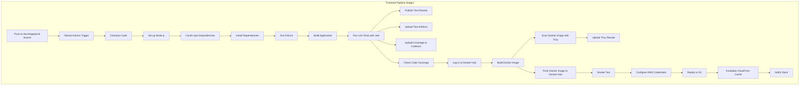

## Frontend Pipeline Stages

Each pipeline consists of two jobs (`lint` and `build-and-deploy`) running on an `ubuntu-latest` runner. Stages are executed sequentially with environment-specific configurations for the Acharya ERP frontend, a React-based application.



Below is an explanation of key terms from the CI/CD pipeline for the frontend of the Acharya ERP system, a React-based application. The pipeline ensures the React app is linted, built, tested, secured, and deployed reliably to a development environment using AWS S3 and CloudFront. Relevant YAML snippets from the workflow are included for each stage.

## Terms Explained

### 1. Checkout Code
Retrieves the source code from the repository.  
- **Tool**: Uses `actions/checkout@v4` to clone the `dev` branch of the Acharya ERP repository.  
- **Why It’s Needed**: Provides the React codebase for linting, building, and testing.  
- **YAML Snippet**:
```yaml
- name: Checkout code
  uses: actions/checkout@v4
```

### 2. Set up Node.js
Configures the Node.js environment for the React app.  
- **Tool**: Uses `actions/setup-node@v4` to install Node.js (version 18).  
- **Why It’s Needed**: Enables npm commands for dependency management, linting, building, and testing.  
- **YAML Snippet**:
```yaml
- name: Set up Node.js
  uses: actions/setup-node@v4
  with:
    node-version: '18.x'
    cache: 'npm'
```

### 3. Cache npm Dependencies
Speeds up builds by caching dependencies.  
- **Tool**: Uses `actions/cache@v4` to cache `node_modules` based on `package-lock.json`.  
- **Why It’s Needed**: Reduces build time for the Acharya ERP frontend.  
- **YAML Snippet**:
```yaml
- name: Cache npm dependencies
  uses: actions/cache@v4
  with:
    path: ~/.npm
    key: ${{ runner.os }}-node-${{ hashFiles('**/package-lock.json') }}
    restore-keys: |
      ${{ runner.os }}-node-
```

### 4. Install Dependencies
Installs the necessary npm packages for the React app.  
- **Tool**: Uses `npm ci` for a clean and consistent installation of dependencies.  
- **Why It’s Needed**: Ensures all required libraries are available for linting, building, and testing.  
- **YAML Snippet**:
```yaml
- name: Install dependencies
  run: npm ci
```

### 5. Run ESLint
Analyzes the React app’s source code for coding issues and security vulnerabilities.  
- **Tool**: **ESLint** checks JavaScript code for errors or insecure patterns via `npm run lint -- --quiet --format json`.  
- **Why It’s Needed**: Improves code quality and security for the Acharya ERP app.  
- **YAML Snippet**:
```yaml
- name: Run ESLint
  run: |
    LINT_ERRORS=$(npm run lint -- --quiet --format json | jq '.[] | select(.errorCount > 0)')
    if [ -n "$LINT_ERRORS" ]; then
      echo "❌ ESLint found errors"
      exit 1
    else
      echo "✅ ESLint passed with no errors"
    fi
```

### 6. Build Application
Compiles the React app’s source code (JavaScript, CSS, HTML) into a deployable package.  
- **Tool**: Uses `npm run build` to generate static assets, with environment variables like `REACT_APP_API_URL`.  
- **Why It’s Needed**: Creates the production-ready assets for the Acharya ERP frontend.  
- **YAML Snippet**:
```yaml
- name: Build application
  run: npm run build
  env:
    REACT_APP_API_URL: ${{ secrets.REACT_APP_API_URL_DEV }}
```

### 7. Run Unit Tests with Jest
Runs automated tests to validate individual components (e.g., React components, functions).  
- **Tool**: Uses `npm test -- --coverage` with **Jest** for unit tests and coverage reports.  
- **Why It’s Needed**: Ensures functionality and reliability of the Acharya ERP app.  
- **YAML Snippet**:
```yaml
- name: Run tests
  run: npm test -- --coverage
  continue-on-error: false
```

### 8. Publish Test Results
Displays test results in GitHub for visibility.  
- **Tool**: Uses `dorny/test-reporter@v1` to publish Jest JUnit reports (`coverage/junit.xml`).  
- **Why It’s Needed**: Provides feedback on test outcomes for developers.  
- **YAML Snippet**:
```yaml
- name: Publish Test Results
  uses: dorny/test-reporter@v1
  if: always()
  with:
    name: Jest Tests (Dev)
    path: coverage/junit.xml
    reporter: jest-junit
    fail-on-error: false
  continue-on-error: true
```

### 9. Upload Test Artifacts
Stores test and coverage reports for later analysis.  
- **Tool**: Uses `actions/upload-artifact@v4` to upload `junit.xml` and other reports (30-day retention).  
- **Why It’s Needed**: Allows developers to review test details for the Acharya ERP app.  
- **YAML Snippet**:
```yaml
- name: Upload Test Results as Artifacts
  uses: actions/upload-artifact@v4
  if: always()
  with:
    name: test-results-dev
    path: coverage/junit.xml
    retention-days: 30
```

### 10. Upload Coverage to Codecov
Tracks coverage metrics over time.  
- **Tool**: Uses `codecov/codecov-action@v4` to upload `lcov.info` to Codecov.  
- **Why It’s Needed**: Monitors coverage trends to ensure test quality.  
- **YAML Snippet**:
```yaml
- name: Upload Coverage to Codecov
  uses: codecov/codecov-action@v4
  if: always()
  with:
    file: ./coverage/lcov.info
    flags: unittests
    name: codecov-umbrella-dev
```

### 11. Check Code Coverage
Ensures the code coverage meets a minimum threshold (80%).  
- **Tool**: Parses `coverage/coverage-summary.json` to verify line coverage percentage.  
- **Why It’s Needed**: Enforces high test coverage to reduce bugs in the Acharya ERP system.  
- **YAML Snippet**:
```yaml
- name: Check Code Coverage
  run: |
    if [ ! -f ./coverage/coverage-summary.json ]; then
      echo "❌ Coverage summary file not found"
      exit 1
    fi
    COVERAGE=$(node -p "require('./coverage/coverage-summary.json').total.lines.pct")
    if (( $(echo "$COVERAGE < 80" | bc -l) )); then
      echo "❌ Code coverage is $COVERAGE%, below the 80% threshold"
      exit 1
    else
      echo "✅ Code coverage is $COVERAGE%, meets the 80% threshold"
    fi
```

### 12. SCA (Software Composition Analysis)
Scans third-party dependencies (e.g., React libraries, npm packages) for vulnerabilities or outdated versions.  
- **Tool**: **Dependabot** automatically creates pull requests for updating JavaScript dependencies, configured via `.github/dependabot.yml`.  
- **Why It’s Needed**: Ensures dependency security for the Acharya ERP frontend.  
- **YAML Snippet**: Not part of the main workflow; configured in `.github/dependabot.yml`.

### 13. Log in to Docker Hub
Authenticates with Docker Hub to enable image pushing.  
- **Tool**: Uses `docker/login-action@v3` with credentials stored in GitHub secrets.  
- **Why It’s Needed**: Allows the pipeline to publish Docker images for the Acharya ERP app.  
- **YAML Snippet**:
```yaml
- name: Log in to Docker Hub
  uses: docker/login-action@v3
  with:
    username: ${{ secrets.DOCKER_USERNAME_DEV }}
    password: ${{ secrets.DOCKER_PASSWORD_DEV }}
```

### 14. Build Docker Image
Packages the React app into a portable Docker image.  
- **Tool**: Uses `docker build` to create an image tagged as `frontend:dev-<sha>` and `frontend:dev-latest`.  
- **Why It’s Needed**: Ensures consistent environments for testing and deployment.  
- **YAML Snippet**:
```yaml
- name: Build Docker Image
  run: |
    docker build -t ${{ secrets.DOCKER_USERNAME_DEV }}/frontend:dev-${{ github.sha }} .
    docker tag ${{ secrets.DOCKER_USERNAME_DEV }}/frontend:dev-${{ github.sha }} ${{ secrets.DOCKER_USERNAME_DEV }}/frontend:dev-latest
```

### 15. Scan Docker Image with Trivy
Checks the Docker image for vulnerabilities in dependencies or configuration.  
- **Tool**: Uses `aquasecurity/trivy-action@master` to scan and output results in SARIF format (`trivy-results.sarif`).  
- **Why It’s Needed**: Ensures container security before deployment.  
- **YAML Snippet**:
```yaml
- name: Scan Docker Image with Trivy
  uses: aquasecurity/trivy-action@master
  with:
    image-ref: ${{ secrets.DOCKER_USERNAME_DEV }}/frontend:dev-${{ github.sha }}
    format: 'sarif'
    output: 'trivy-results.sarif'
    exit-code: '1'
    severity: 'CRITICAL'
```

### 16. Upload Trivy Scan Results
Displays Docker image vulnerabilities in GitHub.  
- **Tool**: Uses `github/codeql-action/upload-sarif@v3` to upload `trivy-results.sarif`.  
- **Why It’s Needed**: Provides visibility into container security issues.  
- **YAML Snippet**:
```yaml
- name: Upload Trivy scan results
  uses: github/codeql-action/upload-sarif@v3
  if: always() && github.actor != 'dependabot[bot]'
  with:
    sarif_file: 'trivy-results.sarif'
```

### 17. Push Docker Image to Docker Hub
Publishes the Docker image to a registry.  
- **Tool**: Uses `docker push` to upload `frontend:dev-<sha>` and `frontend:dev-latest` to Docker Hub.  
- **Why It’s Needed**: Makes the image available for deployment or sharing in the Acharya ERP pipeline.  
- **YAML Snippet**:
```yaml
- name: Push Docker Image to Docker Hub
  run: |
    docker push ${{ secrets.DOCKER_USERNAME_DEV }}/frontend:dev-${{ github.sha }}
    docker push ${{ secrets.DOCKER_USERNAME_DEV }}/frontend:dev-latest
```

### 18. Smoke Test
Verifies core functionality of the React app within the Docker image (e.g., app loads, key components render).  
- **Tool**: Runs the Docker image and checks for an HTTP 200 status on the homepage endpoint using `curl`.  
- **Why It’s Needed**: Ensures the Acharya ERP frontend is stable for deployment.  
- **YAML Snippet**:
```yaml
- name: Smoke Test
  run: |
    echo "Starting smoke test (Dev)..."
    docker stop smokerun-dev 2>/dev/null || true
    docker rm smokerun-dev 2>/dev/null || true
    docker run -d --name smokerun-dev -p 8080:80 \
      ${{ secrets.DOCKER_USERNAME_DEV }}/frontend:dev-${{ github.sha }}
    echo "Waiting for application to start..."
    for i in {1..6}; do
      if curl -f -s http://localhost:8080 > /dev/null 2>&1; then
        echo "✅ Application started successfully!"
        break
      fi
      if [ $i -eq 6 ]; then
        echo "❌ Application failed to start within 30 seconds"
        docker logs smokerun-dev
        docker rm -f smokerun-dev
        exit 1
      fi
      echo "Waiting... (attempt $i/6)"
      sleep 5
    done
    HTTP_STATUS=$(curl -s -o /dev/null -w "%{http_code}" http://localhost:8080)
    if [ "$HTTP_STATUS" -eq 200 ]; then
      echo "✅ HTTP status check passed (200 OK)"
    else
      echo "❌ HTTP status check failed (returned $HTTP_STATUS)"
      docker rm -f smokerun-dev
      exit 1
    fi
    docker rm -f smokerun-dev
    echo "✅ Smoke test completed successfully!"
```

### 19. Configure AWS Credentials
Authenticates with AWS for S3 and CloudFront access.  
- **Tool**: Uses `aws-actions/configure-aws-credentials@v4` with dev-specific credentials.  
- **Why It’s Needed**: Enables deployment to AWS services.  
- **YAML Snippet**:
```yaml
- name: Configure AWS Credentials
  uses: aws-actions/configure-aws-credentials@v4
  with:
    aws-access-key-id: ${{ secrets.AWS_ACCESS_KEY_ID_DEV }}
    aws-secret-access-key: ${{ secrets.AWS_SECRET_ACCESS_KEY_DEV }}
    aws-region: ${{ secrets.AWS_REGION_DEV }}
```

### 20. Deploy to S3
Deploys the React app’s static assets to an S3 bucket.  
- **Tool**: Uses `aws s3 sync` to upload the `build/` directory to an S3 bucket.  
- **Why It’s Needed**: Delivers the Acharya ERP frontend to users in the development environment.  
- **YAML Snippet**:
```yaml
- name: Deploy to S3
  run: aws s3 sync ./build/ s3://${{ secrets.S3_BUCKET_DEV }} --delete
```

### 21. Invalidate CloudFront Cache
Refreshes the CloudFront cache to serve the latest assets.  
- **Tool**: Uses `aws cloudfront create-invalidation` to invalidate cache paths (`/*`).  
- **Why It’s Needed**: Ensures users access the latest version of the Acharya ERP frontend.  
- **YAML Snippet**:
```yaml
- name: Invalidate CloudFront Cache
  run: aws cloudfront create-invalidation --distribution-id ${{ secrets.CLOUDFRONT_DISTRIBUTION_ID_DEV }} --paths "/*"
```

### 22. Notify Slack
Sends pipeline status notifications to a Slack channel.  
- **Tool**: Uses `slackapi/slack-github-action@v1` to send a message to the `dev-notifications` channel with pipeline status, commit, and run details.  
- **Why It’s Needed**: Keeps the team informed about pipeline outcomes for the Acharya ERP system.  
- **YAML Snippet**:
```yaml
- name: Notify Slack
  if: always()
  uses: slackapi/slack-github-action@v1
  with:
    slack-bot-token: ${{ secrets.SLACK_BOT_TOKEN }}
    channel-id: 'dev-notifications'
    text: |
      *Acharya ERP Frontend (Dev) Pipeline*
      Status: ${{ job.status }}
      Commit: ${{ github.sha }}
      Run: ${{ github.server_url }}/${{ github.repository }}/actions/runs/${{ github.run_id }}
```
---

### YAML Workflow (Dev) 

`.github/workflows/frontend-dev.yml`

```yaml
name: Acharya ERP Frontend CI/CD (Dev)

on:
  push:
    branches:
      - dev

permissions:
  contents: read
  actions: read
  checks: write
  pull-requests: write
  security-events: write
  statuses: write

jobs:
  lint:
    runs-on: ubuntu-latest
    steps:
      - name: Checkout code
        uses: actions/checkout@v4

      - name: Set up Node.js
        uses: actions/setup-node@v4
        with:
          node-version: '18.x'
          cache: 'npm'

      - name: Cache npm dependencies
        uses: actions/cache@v4
        with:
          path: ~/.npm
          key: ${{ runner.os }}-node-${{ hashFiles('**/package-lock.json') }}
          restore-keys: |
            ${{ runner.os }}-node-

      - name: Install dependencies
        run: npm ci

      - name: Run ESLint
        run: |
          LINT_ERRORS=$(npm run lint -- --quiet --format json | jq '.[] | select(.errorCount > 0)')
          if [ -n "$LINT_ERRORS" ]; then
            echo "❌ ESLint found errors"
            exit 1
          else
            echo "✅ ESLint passed with no errors"
          fi

  build-and-deploy:
    runs-on: ubuntu-latest
    needs: lint
    steps:
      - name: Checkout code
        uses: actions/checkout@v4

      - name: Set up Node.js
        uses: actions/setup-node@v4
        with:
          node-version: '18.x'
          cache: 'npm'

      - name: Cache npm dependencies
        uses: actions/cache@v4
        with:
          path: ~/.npm
          key: ${{ runner.os }}-node-${{ hashFiles('**/package-lock.json') }}
          restore-keys: |
            ${{ runner.os }}-node-

      - name: Install dependencies
        run: npm ci

      - name: Build application
        run: npm run build
        env:
          REACT_APP_API_URL: ${{ secrets.REACT_APP_API_URL_DEV }}

      - name: Run tests
        run: npm test -- --coverage
        continue-on-error: false

      - name: Publish Test Results
        uses: dorny/test-reporter@v1
        if: always()
        with:
          name: Jest Tests (Dev)
          path: coverage/junit.xml
          reporter: jest-junit
          fail-on-error: false
        continue-on-error: true

      - name: Upload Test Results as Artifacts
        uses: actions/upload-artifact@v4
        if: always()
        with:
          name: test-results-dev
          path: coverage/junit.xml
          retention-days: 30

      - name: Upload Coverage to Codecov
        uses: codecov/codecov-action@v4
        if: always()
        with:
          file: ./coverage/lcov.info
          flags: unittests
          name: codecov-umbrella-dev

      - name: Check Code Coverage
        run: |
          if [ ! -f ./coverage/coverage-summary.json ]; then
            echo "❌ Coverage summary file not found"
            exit 1
          fi
          COVERAGE=$(node -p "require('./coverage/coverage-summary.json').total.lines.pct")
          if (( $(echo "$COVERAGE < 80" | bc -l) )); then
            echo "❌ Code coverage is $COVERAGE%, below the 80% threshold"
            exit 1
          else
            echo "✅ Code coverage is $COVERAGE%, meets the 80% threshold"
          fi

      - name: Log in to Docker Hub
        uses: docker/login-action@v3
        with:
          username: ${{ secrets.DOCKER_USERNAME_DEV }}
          password: ${{ secrets.DOCKER_PASSWORD_DEV }}

      - name: Build Docker Image
        run: |
          docker build -t ${{ secrets.DOCKER_USERNAME_DEV }}/frontend:dev-${{ github.sha }} .
          docker tag ${{ secrets.DOCKER_USERNAME_DEV }}/frontend:dev-${{ github.sha }} ${{ secrets.DOCKER_USERNAME_DEV }}/frontend:dev-latest

      - name: Scan Docker Image with Trivy
        uses: aquasecurity/trivy-action@master
        with:
          image-ref: ${{ secrets.DOCKER_USERNAME_DEV }}/frontend:dev-${{ github.sha }}
          format: 'sarif'
          output: 'trivy-results.sarif'
          exit-code: '1'
          severity: 'CRITICAL'

      - name: Upload Trivy scan results
        uses: github/codeql-action/upload-sarif@v3
        if: always() && github.actor != 'dependabot[bot]'
        with:
          sarif_file: 'trivy-results.sarif'

      - name: Push Docker Image to Docker Hub
        run: |
          docker push ${{ secrets.DOCKER_USERNAME_DEV }}/frontend:dev-${{ github.sha }}
          docker push ${{ secrets.DOCKER_USERNAME_DEV }}/frontend:dev-latest

      - name: Smoke Test
        run: |
          echo "Starting smoke test (Dev)..."
          docker stop smokerun-dev 2>/dev/null || true
          docker rm smokerun-dev 2>/dev/null || true
          docker run -d --name smokerun-dev -p 8080:80 \
            ${{ secrets.DOCKER_USERNAME_DEV }}/frontend:dev-${{ github.sha }}
          echo "Waiting for application to start..."
          for i in {1..6}; do
            if curl -f -s http://localhost:8080 > /dev/null 2>&1; then
              echo "✅ Application started successfully!"
              break
            fi
            if [ $i -eq 6 ]; then
              echo "❌ Application failed to start within 30 seconds"
              docker logs smokerun-dev
              docker rm -f smokerun-dev
              exit 1
            fi
            echo "Waiting... (attempt $i/6)"
            sleep 5
          done
          HTTP_STATUS=$(curl -s -o /dev/null -w "%{http_code}" http://localhost:8080)
          if [ "$HTTP_STATUS" -eq 200 ]; then
            echo "✅ HTTP status check passed (200 OK)"
          else
            echo "❌ HTTP status check failed (returned $HTTP_STATUS)"
            docker rm -f smokerun-dev
            exit 1
          fi
          docker rm -f smokerun-dev
          echo "✅ Smoke test completed successfully!"

      - name: Configure AWS Credentials
        uses: aws-actions/configure-aws-credentials@v4
        with:
          aws-access-key-id: ${{ secrets.AWS_ACCESS_KEY_ID_DEV }}
          aws-secret-access-key: ${{ secrets.AWS_SECRET_ACCESS_KEY_DEV }}
          aws-region: ${{ secrets.AWS_REGION_DEV }}

      - name: Deploy to S3
        run: aws s3 sync ./build/ s3://${{ secrets.S3_BUCKET_DEV }} --delete

      - name: Invalidate CloudFront Cache
        run: aws cloudfront create-invalidation --distribution-id ${{ secrets.CLOUDFRONT_DISTRIBUTION_ID_DEV }} --paths "/*"

      - name: Notify Slack
        if: always()
        uses: slackapi/slack-github-action@v katon
        with:
          slack-bot-token: ${{ secrets.SLACK_BOT_TOKEN }}
          channel-id: 'dev-notifications'
          text: |
            *Acharya ERP Frontend (Dev) Pipeline*
            Status: ${{ job.status }}
            Commit: ${{ github.sha }}
            Run: ${{ github.server_url }}/${{ github.repository }}/actions/runs/${{ github.run_id }}
```